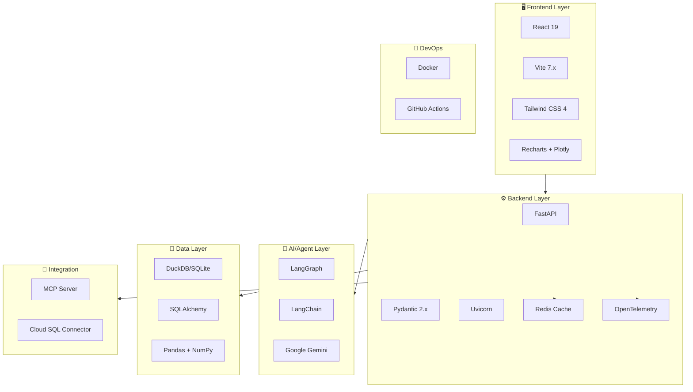
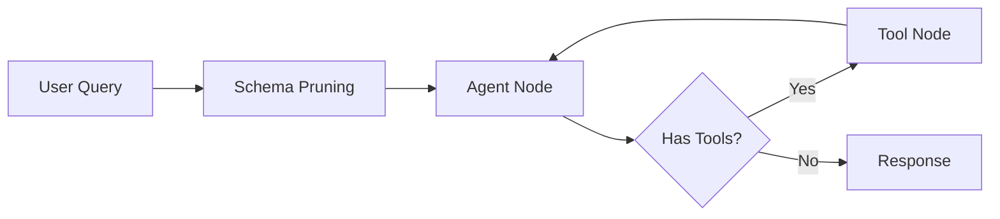
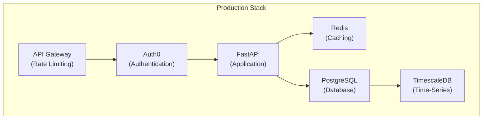
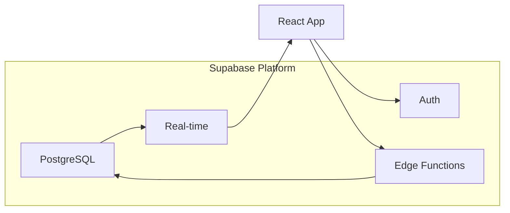
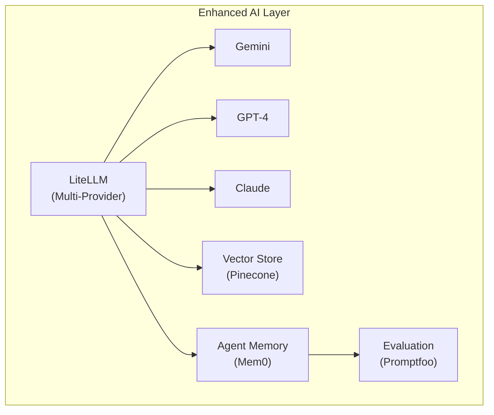

# 🎾 AskTennis Tech Stack Analysis

> **Document Purpose:** A comprehensive analysis of the current technology stack, evaluation of its strengths and weaknesses, and recommendations for alternative stacks based on different improvement goals.

---

## 📋 Table of Contents

1. [Current Tech Stack Overview](#current-tech-stack-overview)
2. [Detailed Component Analysis](#detailed-component-analysis)
3. [Pros and Cons Analysis](#pros-and-cons-analysis)
4. [Alternative Tech Stack Recommendations](#alternative-tech-stack-recommendations)
5. [Migration Considerations](#migration-considerations)
6. [Summary](#summary)

---

## Current Tech Stack Overview



### Quick Reference Table

| Layer | Technology | Version | Purpose |
|-------|------------|---------|---------|
| **Frontend** | React | 19.2.0 | UI Framework |
| **Frontend** | Vite | 7.2.4 | Build Tool |
| **Frontend** | TypeScript | 5.x | Strict Type Safety |
| **Frontend** | Tailwind CSS | 4.0.0 | Styling |
| **Frontend** | Recharts/Plotly | 3.6.0 / 2.35.2 | Data Visualization |
| **Frontend** | Zustand | 5.0.10 | State Management |
| **Backend** | FastAPI | ≥0.100.0 | API Framework |
| **Backend** | Pydantic | ≥2.0.0 | Data Validation |
| **Backend** | Uvicorn | ≥0.23.0 | ASGI Server |
| **Backend** | Redis | 5.x | Distributed Caching |
| **Backend** | OpenTelemetry | 1.x | Observability/Tracing |
| **Backend** | SlowAPI | ≥0.1.9 | Rate Limiting |
| **Backend** | API Key Auth | Custom | Security |
| **Backend** | Structlog | ≥23.1.0 | Structured Logging |
| **AI** | LangGraph | ≥0.2.0 | Agent Orchestration |
| **AI** | LangChain | ≥0.3.0 | LLM Framework |
| **AI** | Google Gemini | - | LLM Provider |
| **Data** | DuckDB/SQLite | - | Database |
| **Data** | SQLAlchemy | ≥1.4.0 | ORM |
| **Data** | Pandas | ≥1.5.0 | Data Processing |
| **DevOps** | Docker | - | Containerization |
| **DevOps** | GitHub Actions | - | CI/CD Pipeline |

---

## Detailed Component Analysis

### 🖥️ Frontend Stack

#### React 19 + Vite 7

The frontend uses **React 19** (latest stable) with **Vite** as the build tool, representing a cutting-edge modern setup.

**Architecture Highlights:**

- TypeScript components (`.tsx` files) with **Strict Mode** enabled
- Custom hooks pattern (`useAiQuery`)
- Component-based architecture with clear separation:
  - `components/layout/` - Layout components
  - `components/views/` - Page views
  - `components/ui/` - Reusable UI components
  - `components/search/` - Search functionality

**Key Dependencies:**

```json
{
  "react": "^19.2.0",
  "axios": "^1.13.2",
  "recharts": "^3.6.0",
  "react-plotly.js": "^2.6.0",
  "react-markdown": "^10.1.0",
  "lucide-react": "^0.562.0",
  "tailwindcss": "^4.0.0",
  "zustand": "^5.0.10"
}
```

---

### ⚙️ Backend Stack

#### FastAPI + Pydantic

The backend is built on **FastAPI**, Python's modern async web framework.

**Architecture Highlights:**

- Modular router structure (`api/routers/`)
- Service layer pattern (`services/`)
- Factory pattern for agent creation (`agent/agent_factory.py`)
- Clean separation of concerns:
  - `config/` - Configuration management (incl. Observability)
  - `graph/` - LangGraph builder
  - `llm/` - LLM setup and tools
  - `tennis/` - Domain-specific logic
  - `services/` - Business logic (incl. Redis/DiskCache)

**API Design:**

```python
# RESTful endpoints under /api prefix
/api/query       # AI-powered natural language queries
/api/filters     # Filter data endpoints
/api/matches     # Match data endpoints  
/api/stats       # Statistics endpoints
```

---

### 🤖 AI/Agent Stack

#### LangGraph + LangChain + Google Gemini

The AI layer uses **LangGraph** for agent orchestration with **Google Gemini** as the LLM provider.

**Architecture Highlights:**

- Graph-based agent workflow in `graph/langgraph_builder.py`
- Custom tool creation with schema pruning
- Memory management with disk cache
- Dynamic prompt engineering (`tennis/tennis_prompts.py`)
- Schema pruning for context optimization (`tennis/tennis_schema_pruner.py`)

**Agent Flow:**



---

### 💾 Data Stack

#### DuckDB/SQLite + SQLAlchemy + Pandas

The data layer uses **embedded databases** (DuckDB/SQLite) with **SQLAlchemy** ORM.

**Database File:** `tennis_data_with_mcp.db` (~2GB)

**Key Features:**

- Cloud SQL connector support for production
- Custom query tools with column name inclusion
- Pandas integration for data analysis
- Flexible database factory pattern

---

### 🔌 Integration Layer

#### MCP Server

An **MCP (Model Context Protocol)** server provides tool access for external AI agents.

**Exposed Tools:**

- `list_tables()` - List database tables
- `query_tennis_database()` - Execute SQL queries

**Exposed Resources:**

- `tennis://schema` - Database schema
- `tennis://questions` - Analytical questions

---

### 🐳 Infrastructure / DevOps

#### Docker Support

The project includes containerization support via **Docker** and **Docker Compose**.

**Services:**
- `backend`: FastAPI application (Port 8000)
- `frontend`: React/Vite application (Port 80/3000)
- `redis`: Redis cache (Port 6379) - *Fully integrated for caching*

#### CI/CD (GitHub Actions)
- Automated testing (`pytest`)
- Code quality checks (`ruff` linting)
- Frontend type checking (`tsc`) and build verification

---

## Pros and Cons Analysis

### ✅ Strengths

| Category | Strength | Impact |
|----------|----------|--------|
| **Performance** | React 19 with concurrent features | Smoother UI interactions |
| **Performance** | DuckDB for analytical queries | Lightning-fast OLAP queries |
| **Performance** | Vite for instant HMR | Fast development cycles |
| **DX** | FastAPI auto-generated docs | Self-documenting API |
| **DX** | TypeScript in frontend | Type safety, better IDE support |
| **DX** | Pydantic validation | Robust data validation |
| **AI** | LangGraph state machines | Complex agent workflows |
| **AI** | Schema pruning | Efficient context usage |
| **AI** | MCP server | Interoperability with AI clients |
| **Scalability** | Cloud SQL support | Production-ready path |
| **Modularity** | Factory patterns | Easy testing and extension |

---

## Alternative Tech Stack Recommendations

### 🎯 Recommendation 1: Production Hardening Stack

**Goal:** Security, Scalability, and Enterprise Readiness

| Component | Current | Recommended | Reason |
|-----------|---------|-------------|--------|
| Database | DuckDB (embedded) | **PostgreSQL + TimescaleDB** | Multi-user, time-series optimization |
| Caching | Redis + DiskCache | **Redis** | Distributed, production-grade |
| Auth | API Key | **Auth0 / Clerk / Supabase Auth** | Enterprise SSO, JWT handling |
| Deployment | Docker + GHA | **Docker + Kubernetes** | Consistent environments, scaling |
| Monitoring | OpenTelemetry | **OpenTelemetry + Grafana** | Full observability |
| API Gateway | None | **Kong / AWS API Gateway** | Rate limiting, security |



**Pros:**

- Enterprise-ready security
- Horizontal scalability
- Full observability
- Proper caching layer

**Cons:**

- Higher operational complexity
- Increased infrastructure costs
- Longer development time

---

### 🎯 Recommendation 2: Performance Optimization Stack

**Goal:** Maximum Query Speed and Real-Time Analytics

| Component | Current | Recommended | Reason |
|-----------|---------|-------------|--------|
| Database | DuckDB | **ClickHouse** | Purpose-built for analytics |
| Search | SQL only | **Elasticsearch** | Full-text search on matches |
| Streaming | None | **Apache Kafka** | Real-time data ingestion |
| Caching | Redis | **Redis + Memcached** | Multi-tier caching |
| Compute | FastAPI | **FastAPI + Ray** | Distributed computation |

**Use Case:** If you need to handle millions of concurrent queries or real-time match data streaming.

**Pros:**

- Sub-millisecond query times
- Horizontal read scaling
- Real-time capabilities

**Cons:**

- Significant infrastructure costs
- Complex operational overhead
- Overkill for current scale

---

### 🎯 Recommendation 3: Simplified Full-Stack (Supabase)

**Goal:** Rapid Development, Lower Maintenance

| Component | Current | Recommended | Reason |
|-----------|---------|-------------|--------|
| Backend | FastAPI | **Supabase Edge Functions** | Serverless, auto-scaling |
| Database | DuckDB | **Supabase PostgreSQL** | Managed, real-time subscriptions |
| Auth | None | **Supabase Auth** | Built-in, JWT tokens |
| Storage | None | **Supabase Storage** | If needed for replays |
| API | REST | **Supabase API + PostgREST** | Auto-generated REST/GraphQL |



**Pros:**

- Minimal infrastructure management
- Built-in auth, storage, real-time
- Rapid development
- Cost-effective at scale

**Cons:**

- Less control over infrastructure
- Vendor lock-in
- May need custom solution for LangGraph

---

### 🎯 Recommendation 4: AI-First Stack Enhancement

**Goal:** Enhanced AI Capabilities and Multi-Model Support

| Component | Current | Recommended | Reason |
|-----------|---------|-------------|--------|
| LLM | Gemini only | **LiteLLM + Multiple Providers** | Model flexibility, fallbacks |
| Vector Store | None | **Pinecone / Weaviate** | Semantic search on matches |
| Agent Framework | LangGraph | **LangGraph + CrewAI** | Multi-agent workflows |
| Memory | Redis + DiskCache | **Mem0 / LangSmith** | Persistent agent memory |
| Evaluation | None | **Promptfoo / Ragas** | LLM output evaluation |

**Enhanced AI Architecture:**



**Pros:**

- Model provider redundancy
- Semantic search capabilities
- Better context management
- Quality evaluation pipeline

**Cons:**

- Multiple API costs
- More complex prompting
- Requires evaluation infrastructure

---

### 🎯 Recommendation 5: Modern JAMstack Alternative

**Goal:** Edge Performance, Global CDN, Simplified Architecture

| Component | Current | Recommended | Reason |
|-----------|---------|-------------|--------|
| Frontend | React + Vite | **Next.js 15 (App Router)** | SSR, edge functions |
| Backend | FastAPI | **Next.js API Routes + tRPC** | Type-safe API |
| Database | DuckDB | **Turso (libSQL)** | Edge-replicated SQLite |
| AI | Custom | **Vercel AI SDK** | Streaming, edge-ready |
| Deployment | None | **Vercel** | Global edge network |

**Pros:**

- Global edge deployment
- End-to-end type safety
- Simplified deployment
- Excellent DX

**Cons:**

- Rewrite of backend logic
- Learning curve for Next.js
- Python AI logic needs porting to JS/TS or API calls

---