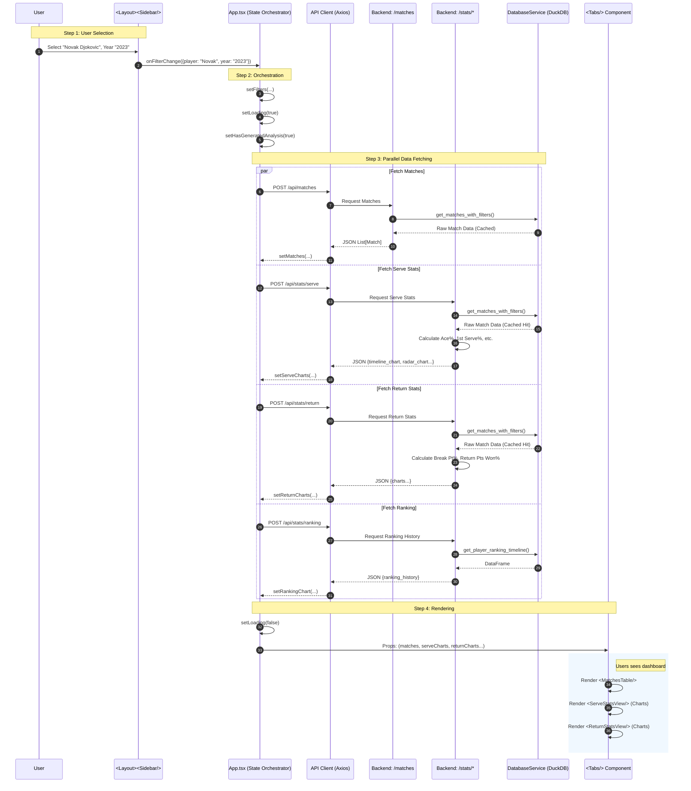

# Data Flow Documentation: Tennis Analysis

## Overview
This document details the end-to-end data flow when a user generates a statistical analysis report (e.g., Serve, Return, Matches) by filtering for a specific player.

## Example Scenario
**User Action**: Selects **"Novak Djokovic"** from the Sidebar Player Dropdown and sets Year to **"2023"**.

### High-Level Flow
1.  **Sidebar Component**: Detects change, calls `onFilterChange`.
2.  **App Component**: Receives new filter state, triggers `handleFilterChange`.
3.  **API Requests**: `App.tsx` fires 4 parallel async requests to the Backend.
4.  **Backend Processing**: FastAPI routers call `DatabaseService` (now cached) to fetch raw match data, then compute statistics.
5.  **Frontend State**: Responses are stored in React State (`matches`, `serveCharts`, etc.).
6.  **Results Rendering**: The `Tabs` component propagates data to specific views (`MatchesTable`, `ServeStatsView`).

## Detailed Architecture Diagram



## Data Transformation Steps

### 1. Frontend: Filter Construction
`App.tsx` constructs a `ServeStatsRequest` object:
```json
{
  "player_name": "Novak Djokovic",
  "opponent": undefined,
  "tournament": undefined,
  "surface": [],
  "year": "2023"
}
```

### 2. Backend: Database Query (Optimized)
The `DatabaseService` receives the request.
*   **Cache Check**: Checks `@lru_cache` for signature `("Novak Djokovic", "2023", ...)`.
*   **Query**: Executes SQL:
    ```sql
    SELECT * FROM matches 
    WHERE (winner_name = 'Novak Djokovic' OR loser_name = 'Novak Djokovic')
    AND event_year = 2023
    ```
*   **Return**: Returns a pandas DataFrame of ~60 matches.

### 3. Backend: Stats Calculation
*   **Serve Stats**: Iterates DataFrame. Calculates:
    *   aces / total_serve_points
    *   1st_serve_in / total_serve_points
*   **Comparisons**: Calculates the same stats for the *opponent* in those matches for context.

### 4. Frontend: Visualization
The Frontend receives pre-calculated JSON ready for `Recharts` or `Nivo`.
```json
{
  "timeline_chart": [
    {"date": "2023-01", "aces": 15, "df": 2},
    {"date": "2023-02", "aces": 12, "df": 1}
  ]
}
```
`ServeStatsView` maps this directly to `<LineChart data={data.timeline_chart} />`.
