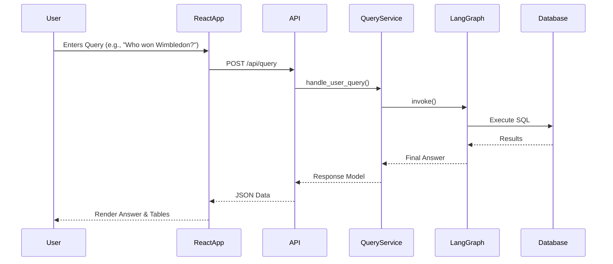

# 🏗️ AskTennis AI - System Architecture

## Overview

AskTennis AI is a comprehensive tennis analytics platform built with a modern, decoupled architecture. The system leverages **React** for a dynamic frontend, **FastAPI** for a high-performance backend, **LangGraph** for AI orchestration, and **Google Gemini AI** (gemini-3-flash-preview) for natural language processing. It provides natural language querying of 147 years of tennis history.

## 🎯 Application Entry Points

The system consists of two main components:

### 1. **Frontend** (React + Vite)
-   **Entry Point**: `frontend/src/main.jsx`
-   **Purpose**: User interface for interaction and visualization
-   **Key Features**:
    -   Modern, responsive UI using CSS variables and modular components
    -   Interactive chat interface for natural language queries
    -   Advanced filtering scenarios
    -   Data visualization using charts (recharts or similar libraries)
-   **Target Users**: Tennis enthusiasts, analysts, researchers

### 2. **Backend** (FastAPI)
-   **Entry Point**: `backend/main.py`
-   **Purpose**: API server handling business logic, data retrieval, and AI processing
-   **Key Features**:
    -   RESTful API endpoints (`/api/query`, `/api/filters`, etc.)
    -   AI Agent orchestration via LangGraph
    -   Database integration (SQLite/Cloud SQL)
    -   Swagger UI documentation at `/docs`

## 🎯 System Architecture Diagram

### **Visual Architecture Overview**
```
┌─────────────────────────────────────────────────────────────────┐
│                        FRONTEND LAYER                          │
│  (React + Vite)                                                 │
├─────────────────────────────────────────────────────────────────┤
│  App.tsx       │  Components   │  API Client    │  State Mgmt   │
│  Router        │  (UI/UX)      │  (Axios/Fetch) │  (React Hooks)│
└─────────────────────────────────────────────────────────────────┘
                                │ HTTP / JSON
                                ▼
┌─────────────────────────────────────────────────────────────────┐
│                        BACKEND LAYER                           │
│  (FastAPI)                                                      │
├─────────────────────────────────────────────────────────────────┤
│  Main App      │  Routers      │  Pydantic      │  Middleware   │
│  (main.py)     │  (api/)       │  Models        │  (CORS, etc.) │
└─────────────────────────────────────────────────────────────────┘
                                │
                                ▼
┌─────────────────────────────────────────────────────────────────┐
│                        AI AGENT LAYER                          │
├─────────────────────────────────────────────────────────────────┤
│  Agent Factory  │  LangGraph   │  Google Gemini  │  Tennis    │
│                 │  Framework   │  AI (gemini-3)  │  Prompt     │
│                 │              │                 │  Builder   │
└─────────────────────────────────────────────────────────────────┘
                                │
                                ▼
┌─────────────────────────────────────────────────────────────────┐
│                       TENNIS CORE LAYER                        │
├─────────────────────────────────────────────────────────────────┤
│  Tennis Core  │  Mapping      │  Mapping      │  Tennis       │
│               │  Dicts        │  Tools        │  Prompts      │
└─────────────────────────────────────────────────────────────────┘
                                │
                                ▼
┌─────────────────────────────────────────────────────────────────┐
│                         DATA LAYER                             │
├─────────────────────────────────────────────────────────────────┤
│  SQLite/Cloud SQL  │  Matches  │  Players  │  Rankings  │  Doubles │
└─────────────────────────────────────────────────────────────────┘
```

### **Component Interaction Flow**
```
User Input → React UI → API Client → FastAPI Endpoint
     │                                     │
     ▼                                     ▼
Display Results ← JSON Response ← Query Processor
                                           │
                                           ▼
                                      Agent Factory
                                           │
                                           ▼
                                      LangGraph Agent
                                           │
                                           ▼
                                      LLM (Gemini)
                                           │
                                           ▼
                                      Database Query
```

## 🧩 Core Components

### 1. **Frontend Layer** (`frontend/`)
-   **`src/App.tsx`**: Main application component and routing.
-   **`src/components/`**: Reusable UI components.
    -   **`SearchPanel`**: Handles user input for natural language queries.
    -   **`FilterPanel`**: UI for selecting players, tournaments, years, etc.
    -   **`ResultsPanel`**: Displays AI responses and SQL data tables.
    -   **`Visualizations`**: Chart components for stats.
-   **`src/api/`**: API client functions to communicate with the backend.
-   **`src/hooks/`**: Custom React hooks for data fetching and state management.

### 2. **Backend Layer** (`backend/`)
-   **`main.py`**: FastAPI application entry point, CORS configuration, and service initialization.
-   **`api/routers/`**: Route definitions grouping related endpoints.
    -   `matches_router.py`: Endpoints for match data.
    -   `filters_router.py`: Endpoints for fetching filter options (players, tournaments).
    -   `stats_router.py`: Endpoints for statistical analysis.
-   **`services/query_service.py`**: Handles logic for processing AI queries (`QueryProcessor`).
-   **`agent/agent_factory.py`**: Sets up the LangGraph agent (`setup_langgraph_agent`).

### 3. **AI Agent Layer** (`backend/agent/`, `backend/graph/`)
-   **LangGraph Framework**: Manages the stateful conversation flow.
-   **Google Gemini AI**: Provides the intelligence for understanding queries and generating SQL.
-   **Schema Pruner**: Optimizes prompts to stay within token limits.

### 4. **Data Layer**
-   **`tennis_data.db`**: SQLite database (or connection to Cloud SQL).
-   **`services/database_service.py`**: Abstraction layer for database interactions.

## 🔄 Data Flow Architecture



## 🚀 Performance Optimizations
-   **FastAPI Async**: Leverages Python's `asyncio` for non-blocking I/O.
-   **React Fast Refresh**: optimized development experience via Vite.
-   **Caching**:
    -   Backend: `@lru_cache` for static data and compiled tools.
    -   Frontend: React Query (or similar) for caching API responses.
-   **Schema Pruning**: Dynamically reduces prompt size for faster LLM inference.

## 🔧 Configuration
-   **`.env`**: Stores sensitive keys (API keys, DB credentials).
-   **`backend/config/`**: Pydantic settings management.

## 🛡️ Error Handling
-   **Backend**: HTTP Exceptions with detail messages for API errors.
-   **Frontend**: Error boundaries and toast notifications for user feedback.
