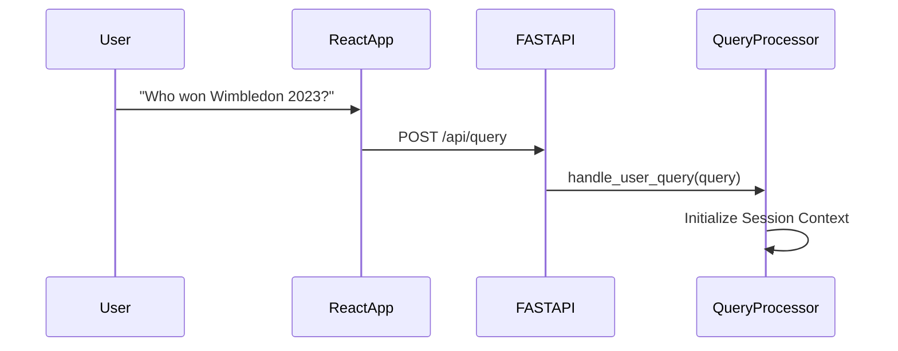
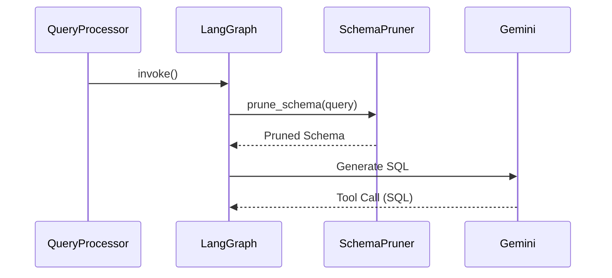
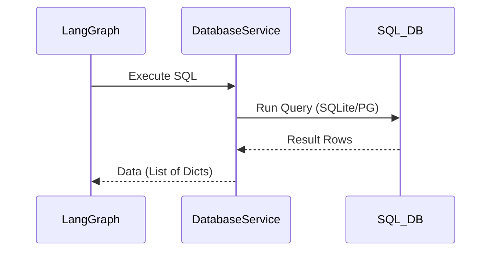
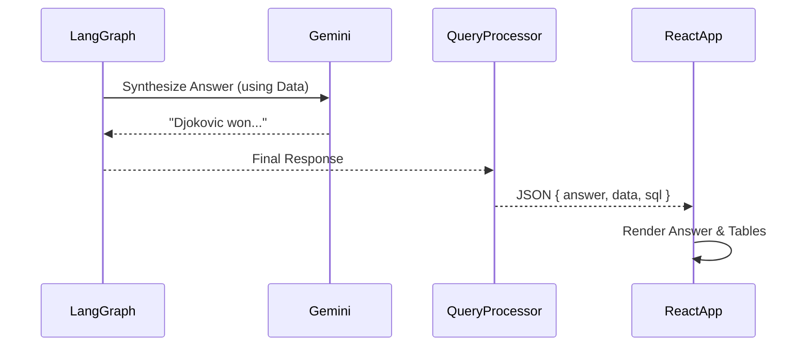

# 🌊 AskTennis AI - Data Flow Architecture

## Overview

The AskTennis AI system processes natural language tennis queries through a sophisticated data flow pipeline. It transforms user questions (from the React Frontend) into structured database queries (via FastAPI Backend) and returns formatted, intelligent responses.

## 🔄 Complete Data Flow Diagram

### **Visual Data Flow Overview**
```
┌─────────────────────────────────────────────────────────────────┐
│                    USER INTERFACE LAYER                        │
├─────────────────────────────────────────────────────────────────┤
│  User Input  →  React Frontend →  API Request →  JSON Response  │
│  (Search Component)                                            │
└─────────────────────────────────────────────────────────────────┘
                                │ HTTP POST
                                ▼
┌─────────────────────────────────────────────────────────────────┐
│                    QUERY PROCESSING LAYER                      │
├─────────────────────────────────────────────────────────────────┤
│  FastAPI Router  →  Query Processor  →  LangGraph Agent        │
└─────────────────────────────────────────────────────────────────┘
                                │
                                ▼
┌─────────────────────────────────────────────────────────────────┐
│                    AI PROCESSING LAYER                         │
├─────────────────────────────────────────────────────────────────┤
│  Schema Pruner  →  Prompt Builder  →  Google Gemini AI         │
│  (Optimizes Context)                                           │
└─────────────────────────────────────────────────────────────────┘
                                │ SQL Generation
                                ▼
┌─────────────────────────────────────────────────────────────────┐
│                    DATA STORAGE LAYER                          │
├─────────────────────────────────────────────────────────────────┤
│  Database Service  →  SQLite / Cloud SQL (PostgreSQL)          │
│  (Executes Query)                                              │
└─────────────────────────────────────────────────────────────────┘
                                │ Raw Data
                                ▼
┌─────────────────────────────────────────────────────────────────┐
│                 RESPONSE PROCESSING LAYER                      │
├─────────────────────────────────────────────────────────────────┤
│  Data Formatter  →  Natural Language Synthesis  →  API Response │
└─────────────────────────────────────────────────────────────────┘
```

## 📊 Detailed Data Flow Steps

### 1. **User Input Processing**



**Process Details:**
- **Input**: User types query in React `SearchPanel`.
- **Transmission**: `axios` or `fetch` sends payload to `/api/query`.
- **Validation**: Pydantic models validate the request body.

### 2. **AI Agent Processing**



**AI Components:**
- **Schema Pruning**: Reduces token usage by identifying only relevant tables/columns.
- **Mapping Tools**: Resolves names like "Djoker" to "Novak Djokovic".

### 3. **Database Query Execution**



### 4. **Response Synthesis & Formatting**



## 📈 Performance Optimization Flows

### 1. **Schema Pruning Optimization**
- Analyzes query keywords.
- Filters out 80% of unneeded schema columns.
- Results in faster LLM inference and lower cost.

### 2. **Caching Strategy**
- **Backend**: `lru_cache` for static resource lists.
- **Frontend**: React state preserves results during session navigation.

## 🛡️ Error Handling Flows

### 1. **Query Error Handling**
- If SQL fails, the Agent catches the error and may retry or return a fallback message.
- Backend returns a 500 or 400 error code if completely failed, which the React frontend catches to display a "Something went wrong" toast.

## 🎯 Key Data Flow Benefits

1.  **Decoupled Architecture**: Frontend and Backend scale independently.
2.  **Efficiency**: Heavy processing happens on the backend/AI, keeping the UI responsive.
3.  **Transparency**: The flow returns generated SQL, allowing the UI to show "How I got this answer".
