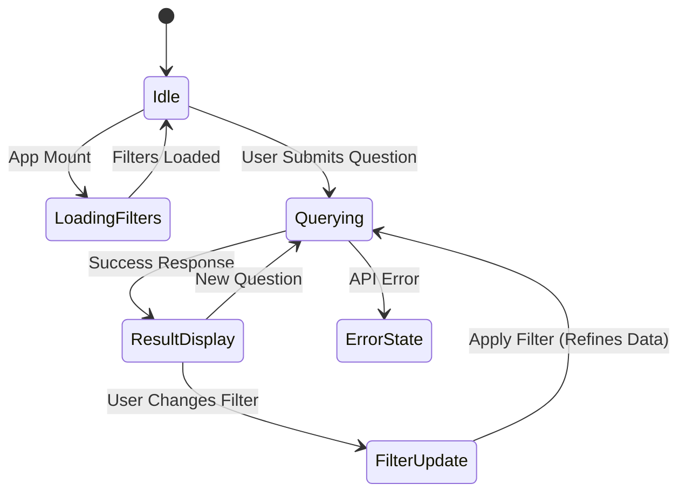
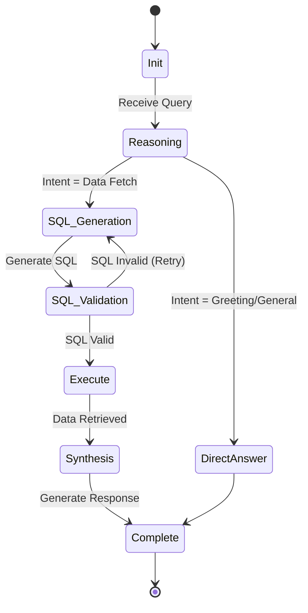

# 🔄 AskTennis AI - State Diagram

## Overview

This document models the life cycle of the application states, focusing on the User Interface (React) and the Agent Processing (Backend) states.

## 🖥️ Application State (Frontend)

The React application moves through several high-level states during user interaction.

### State Descriptions
-   **Idle**: App is loaded, waiting for user input.
-   **LoadingFilters**: Fetching list of players/tournaments from API.
-   **Querying**: Waiting for specific API request (`/api/query`) to complete. Shows spinners/skeletons.
-   **ResultDisplay**: Showing answer card and data tables.
-   **ErrorState**: Showing toast notification or error boundary message.

## 🤖 Agent State (Backend)

The LangGraph agent manages the state of a single conversation thread.

### State Descriptions
-   **Init**: Load conversation history.
-   **Reasoning**: LLM decides next step (Tool call vs Final Answer).
-   **SQL_Generation**: Constructing query based on schema.
-   **Execute**: Running query against Database.
-   **Synthesis**: Combining raw data with natural language.
