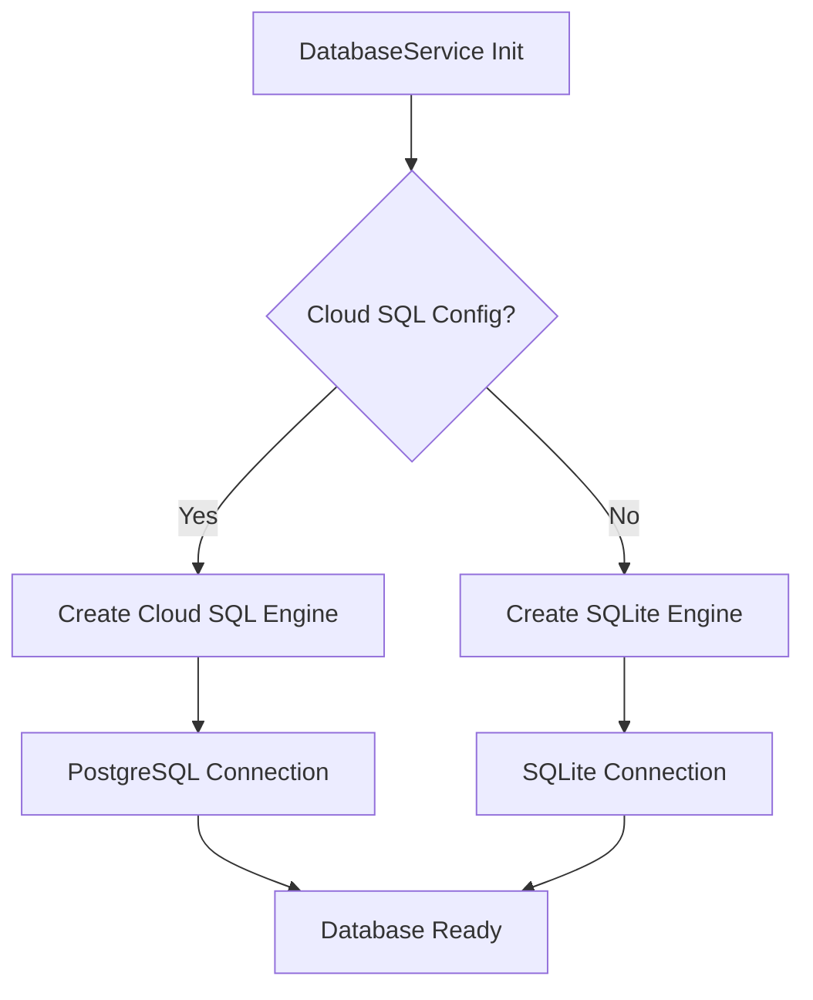
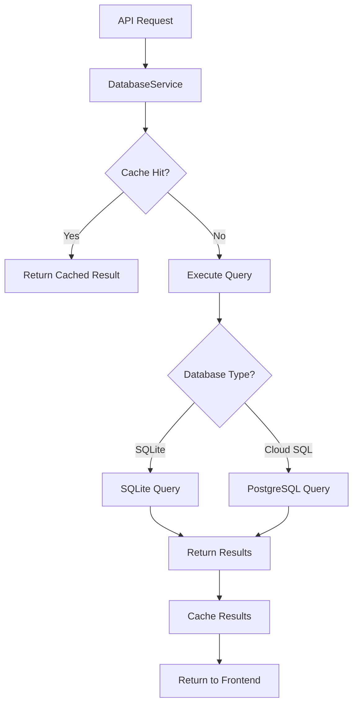

# 🗄️ AskTennis AI - Database Architecture

## Overview

The AskTennis AI system supports a flexible database architecture that accommodates both local development (SQLite) and production deployments (Cloud SQL/PostgreSQL). This document outlines the database architecture, configuration, and optimization strategies for the tennis analytics platform.

## 🎯 Database Architecture Options

### **Current Implementation: Hybrid Approach**

The system currently uses a **hybrid database architecture** that supports:

1. **SQLite** (Local Development)
   - File-based database
   - Zero configuration
   - Fast for local development
   - Suitable for single-user scenarios

2. **Cloud SQL (PostgreSQL)** (Production)
   - Managed PostgreSQL database
   - Scalable and production-ready
   - Supports multiple concurrent users
   - Automatic backups and high availability

## 🏗️ Database Architecture

### **Visual Database Architecture**
```
┌─────────────────────────────────────────────────────────────────┐
│                    BACKEND DATA LAYER                          │
├─────────────────────────────────────────────────────────────────┤
│  Configuration Detection  │  Connection Management  │  Query    │
│  (Environment Variables)  │  (SQLAlchemy)          │  Execution│
└─────────────────────────────────────────────────────────────────┘
                                │
                ┌───────────────┴───────────────┐
                │                               │
                ▼                               ▼
┌───────────────────────────────┐  ┌───────────────────────────────┐
│      SQLite Database          │  │   Cloud SQL (PostgreSQL)      │
│  (Local Development)          │  │   (Production)                │
├───────────────────────────────┤  ├───────────────────────────────┤
│  • File-based storage         │  │  • Managed PostgreSQL         │
│  • Zero configuration         │  │  • Automatic backups          │
│  • Fast local queries         │  │  • High availability          │
│  • Single-user optimized      │  │  • Multi-user support          │
└───────────────────────────────┘  └───────────────────────────────┘
```

## 🔧 Database Configuration

### 1. **SQLite Configuration (Local Development)**

```python
# Default SQLite configuration
DEFAULT_DB_PATH = "sqlite:///tennis_data.db"

# DatabaseService automatically detects SQLite
db_service = DatabaseService()  # Uses SQLite by default
```

**Characteristics:**
- **File-based**: Single file database (`tennis_data.db`)
- **Zero Configuration**: No server setup required
- **Fast**: Optimized for local queries
- **Portable**: Easy to backup and move

### 2. **Cloud SQL Configuration (Production)**

```python
# Cloud SQL configuration via environment variables
INSTANCE_CONNECTION_NAME = "project:region:instance"
DB_USER = "database_user"
DB_PASSWORD = "database_password"
DB_NAME = "tennis_data"
DB_ENGINE = "postgresql"  # or "mysql"

# DatabaseService automatically detects Cloud SQL
db_service = DatabaseService()  # Uses Cloud SQL if configured
```

**Characteristics:**
- **Managed Service**: Fully managed PostgreSQL database
- **Scalable**: Handles multiple concurrent users
- **Reliable**: Automatic backups and high availability
- **Secure**: Encrypted connections and data at rest

## 📊 Database Schema

### **Core Tables**

1. **matches**: 1.7M+ singles matches (1877-2024)
2. **players**: 136K+ players with metadata
3. **rankings**: 5.3M+ ranking records (1973-2024)
4. **doubles_matches**: 26K+ doubles matches (2000-2020)
5. **atp_rankings**: ATP-specific ranking data
6. **wta_rankings**: WTA-specific ranking data
7. **atp_players**: ATP-specific player data
8. **wta_players**: WTA-specific player data

### **Database Views**

- **matches_with_full_info**: Matches with full player information
- **matches_with_rankings**: Matches with ranking context
- **player_rankings_history**: Complete ranking history per player

### **Database Indexes**

- **Match-based indexes**: winner_id, loser_id, year, tournament, surface
- **Player-based indexes**: player_id, name, country, hand
- **Ranking-based indexes**: player, date, rank, tour
- **Composite indexes**: Multi-column indexes for complex queries

## 🚀 Database Service Architecture

### **DatabaseService Class**

```python
class DatabaseService:
    """Service for database operations."""
    
    def __init__(self, db_path=None, db_engine=None):
        """
        Initialize database service.
        Supports both SQLite and Cloud SQL.
        """
        # Automatic detection of database type
        if self._is_cloud_sql_config():
            self.db_engine = self._create_cloud_sql_engine()
        else:
            self.db_engine = create_engine(db_path or DEFAULT_DB_PATH)
```

**Key Features:**
- **Automatic Detection**: Detects database type from environment variables
- **Unified Interface**: Same API for both SQLite and Cloud SQL
- **Connection Pooling**: Efficient connection management
- **LRU Caching**: In-memory caching for frequently accessed static data (via `functools.lru_cache`)

## 🔄 Database Connection Flow

### **Connection Initialization**



### **Query Execution Flow**



## 📈 Performance Optimization

### 1. **Indexing Strategy**

- **Primary Indexes**: On frequently queried columns
- **Composite Indexes**: For multi-column queries
- **Covering Indexes**: For query optimization

### 2. **Caching Strategy**

- **Application Caching**: `lru_cache` for static data (players, tournaments)
- **Connection Pooling**: Reuse database connections
- **Query Result Caching**: Cache frequently accessed data

### 3. **Query Optimization**

- **Schema Pruning**: Reduce schema information in prompts
- **Query Optimization**: Optimize SQL queries for performance
- **Result Truncation**: Limit result sets to 100 rows

## 🛡️ Database Security

### 1. **Connection Security**

- **SSL/TLS**: Encrypted connections (Cloud SQL)
- **Credential Management**: Secure credential storage
- **Access Control**: Role-based access control

### 2. **Data Protection**

- **Encryption at Rest**: Data encrypted in database (Cloud SQL)
- **Encryption in Transit**: Encrypted connections
- **Backup Security**: Encrypted backups

### 3. **Access Control**

- **User Authentication**: Database user authentication
- **Role-Based Access**: Different roles for different operations

## 🔄 Database Migration

### **Migration Strategy**

1. **Development**: Start with SQLite for local development
2. **Staging**: Test with Cloud SQL in staging environment
3. **Production**: Deploy with Cloud SQL for production

### **Data Migration**

- **Export from SQLite**: Export data from SQLite database
- **Import to Cloud SQL**: Import data to PostgreSQL
- **Validation**: Validate data integrity after migration

## 📊 Database Monitoring

### 1. **Performance Monitoring**

- **Query Performance**: Track query execution times
- **Connection Pooling**: Monitor connection pool usage
- **Cache Hit Rates**: Monitor cache effectiveness

### 2. **Health Monitoring**

- **Database Health**: Monitor database health status
- **Connection Health**: Monitor connection status
- **Error Tracking**: Track database errors

## 🔮 Future Database Enhancements

### 1. **Advanced Features**

- **Read Replicas**: For read-heavy workloads
- **Partitioning**: For large tables
- **Materialized Views**: For complex aggregations

### 2. **Scalability**

- **Horizontal Scaling**: Database sharding
- **Vertical Scaling**: Larger instance sizes
- **Load Balancing**: Distribute queries across replicas

### 3. **Advanced Analytics**

- **Time-Series Optimization**: For ranking data
- **Full-Text Search**: For player/tournament names
- **Spatial Data**: For court position analysis

---

## 🎯 Key Database Architecture Benefits

1. **Flexibility**: Support for both SQLite and Cloud SQL
2. **Scalability**: Cloud SQL for production scalability
3. **Performance**: Optimized queries and caching
4. **Reliability**: Automatic backups and high availability
5. **Security**: Encrypted connections and data
6. **Ease of Use**: Automatic configuration detection
7. **Cost Efficiency**: SQLite for development, Cloud SQL for production
8. **Migration Path**: Easy migration from SQLite to Cloud SQL

This database architecture provides a solid foundation for comprehensive tennis analytics while maintaining flexibility, performance, and scalability for both development and production environments.
