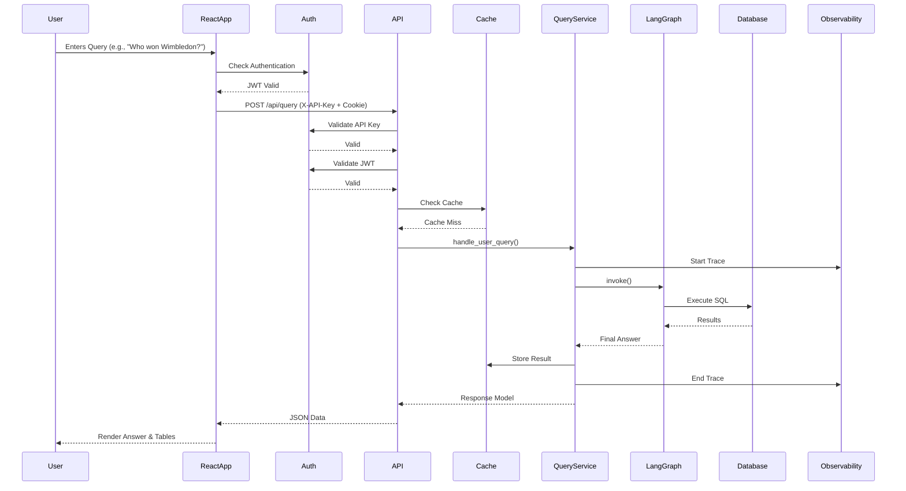

# 🏗️ AskTennis AI - System Architecture

## Overview

AskTennis AI is a comprehensive tennis analytics platform built with a modern, decoupled architecture. The system leverages **React 19** with **TypeScript** for a type-safe frontend, **FastAPI** for a high-performance backend, **LangGraph** for AI orchestration, and **Google Gemini AI** (gemini-3-flash-preview) for natural language processing. It provides natural language querying of 147 years of tennis history with enterprise-grade authentication, caching, and observability.

## 🎯 Application Entry Points

The system consists of two main components:

### 1. **Frontend** (React 19 + Vite 7 + TypeScript)
-   **Entry Point**: `frontend/src/main.tsx`
-   **Purpose**: User interface for interaction and visualization
-   **Key Features**:
    -   Modern, responsive UI using Tailwind CSS 4
    -   TypeScript for type safety
    -   Zustand for state management
    -   Interactive chat interface for natural language queries
    -   Advanced filtering scenarios
    -   Data visualization using Recharts and Plotly.js
    -   JWT-based authentication with HttpOnly cookies
    -   Markdown rendering with KaTeX for mathematical expressions
-   **Target Users**: Tennis enthusiasts, analysts, researchers

### 2. **Backend** (FastAPI + Python 3.11+)
-   **Entry Point**: `backend/main.py`
-   **Purpose**: API server handling business logic, data retrieval, and AI processing
-   **Key Features**:
    -   RESTful API endpoints (`/api/query`, `/api/filters`, `/api/stats`, `/api/matches`, `/auth/login`, `/auth/register`)
    -   Dual-layer authentication (API Key + JWT)
    -   AI Agent orchestration via LangGraph
    -   Multi-database support (DuckDB, SQLite, Cloud SQL PostgreSQL)
    -   Redis caching layer
    -   OpenTelemetry observability
    -   Rate limiting with slowapi
    -   Structured logging with structlog
    -   Swagger UI documentation at `/docs`
    -   MCP (Model Context Protocol) server support

## 🎯 System Architecture Diagram

### **Visual Architecture Overview**
```
┌─────────────────────────────────────────────────────────────────┐
│                        FRONTEND LAYER                          │
│  (React 19 + TypeScript + Tailwind CSS 4)                       │
├─────────────────────────────────────────────────────────────────┤
│  App.tsx       │  Components   │  API Client    │  Zustand      │
│  Router        │  (UI/UX)      │  (Axios)       │  State Mgmt   │
│  AuthContext   │  Views        │  Types         │  Hooks        │
└─────────────────────────────────────────────────────────────────┘
                                │ HTTP / JSON
                                │ X-API-Key Header
                                │ HttpOnly Cookie (JWT)
                                ▼
┌─────────────────────────────────────────────────────────────────┐
│                        BACKEND LAYER                           │
│  (FastAPI + Python 3.11+)                                      │
├─────────────────────────────────────────────────────────────────┤
│  Main App      │  Routers      │  Pydantic      │  Middleware   │
│  (main.py)     │  (api/)       │  Models        │  (CORS, Auth) │
│                │  Auth         │  Schemas       │  Rate Limit   │
│                │               │                │  Logging      │
└─────────────────────────────────────────────────────────────────┘
                                │
                                ▼
┌─────────────────────────────────────────────────────────────────┐
│                    AUTHENTICATION LAYER                        │
├─────────────────────────────────────────────────────────────────┤
│  API Key        │  JWT Token   │  Bcrypt       │  Auth Service │
│  Validation     │  Validation  │  Password Hash│  Auth DB      │
└─────────────────────────────────────────────────────────────────┘
                                │
                                ▼
┌─────────────────────────────────────────────────────────────────┐
│                    CACHING LAYER                               │
├─────────────────────────────────────────────────────────────────┤
│  Redis Cache    │  Disk Cache  │  Cache Service│  LRU Cache   │
│  (Production)   │  (Fallback)  │  Abstraction  │  (Static)     │
└─────────────────────────────────────────────────────────────────┘
                                │
                                ▼
┌─────────────────────────────────────────────────────────────────┐
│                        AI AGENT LAYER                          │
├─────────────────────────────────────────────────────────────────┤
│  Agent Factory  │  LangGraph   │  Google Gemini  │  Tennis    │
│                 │  Framework   │  AI (gemini-3)  │  Prompt     │
│                 │              │                 │  Builder   │
│                 │              │                 │  Schema    │
│                 │              │                 │  Pruner    │
└─────────────────────────────────────────────────────────────────┘
                                │
                                ▼
┌─────────────────────────────────────────────────────────────────┐
│                       TENNIS CORE LAYER                        │
├─────────────────────────────────────────────────────────────────┤
│  Tennis Core  │  Mapping      │  Mapping      │  Tennis       │
│               │  Dicts        │  Tools        │  Prompts      │
│  Ranking      │  Analysis     │  Stats       │  Schema       │
└─────────────────────────────────────────────────────────────────┘
                                │
                                ▼
┌─────────────────────────────────────────────────────────────────┐
│                    DATABASE FACTORY LAYER                      │
├─────────────────────────────────────────────────────────────────┤
│  Database      │  DuckDB       │  SQLite       │  Cloud SQL    │
│  Factory       │  Config       │  Config       │  Config       │
│  (Auto-detect) │  (Local Dev)  │  (Fallback)   │  (Production) │
└─────────────────────────────────────────────────────────────────┘
                                │
                                ▼
┌─────────────────────────────────────────────────────────────────┐
│                         DATA LAYER                             │
├─────────────────────────────────────────────────────────────────┤
│  DuckDB/       │  Matches      │  Players      │  Rankings     │
│  SQLite/       │  Doubles      │  Auth DB      │  Analysis     │
│  Cloud SQL     │  (1.7M+)      │  (136K+)      │  (5.3M+)      │
└─────────────────────────────────────────────────────────────────┘
                                │
                                ▼
┌─────────────────────────────────────────────────────────────────┐
│                    OBSERVABILITY LAYER                         │
├─────────────────────────────────────────────────────────────────┤
│  OpenTelemetry │  Structlog   │  Request ID   │  Tracing      │
│  Tracing       │  Logging     │  Propagation  │  Metrics      │
└─────────────────────────────────────────────────────────────────┘
```

### **Component Interaction Flow**
```
User Input → React UI → Auth Check → API Client → FastAPI Endpoint
     │                                     │
     │                                     ▼
     │                              API Key Check
     │                                     │
     │                                     ▼
     │                              JWT Validation
     │                                     │
     │                                     ▼
     │                              Rate Limiter
     │                                     │
     │                                     ▼
     │                              Cache Check
     │                                     │
     │                                     ▼
     │                              Query Processor
     │                                     │
     │                                     ▼
     │                              Agent Factory
     │                                     │
     │                                     ▼
     │                              LangGraph Agent
     │                                     │
     │                                     ▼
     │                              LLM (Gemini)
     │                                     │
     │                                     ▼
     │                              Database Query
     │                                     │
     │                                     ▼
     │                              Cache Store
     │                                     │
     ▼                                     ▼
Display Results ← JSON Response ← Response Formatter
```

## 🧩 Core Components

### 1. **Frontend Layer** (`frontend/src/`)
-   **`main.tsx`**: Application entry point with React 19.
-   **`App.tsx`**: Main application component with authentication guard and routing.
-   **`components/`**: Reusable UI components organized by feature.
    -   **`views/`**: Page-level components (AiResponseView, StatsDashboardView).
    -   **`search/`**: Search and query components (SearchPanel, QuickInsights).
    -   **`charts/`**: Visualization components (StatsChart).
    -   **`analysis/`**: Analysis components (MatchesTable, Tabs).
    -   **`layout/`**: Layout components (Header, Layout, Sidebar).
    -   **`ui/`**: Reusable UI primitives (DataTable, DataVisualizer, SqlCodeBlock, TennisLoader).
    -   **`Login.tsx`**: Authentication component.
-   **`api/client.ts`**: Axios-based API client with authentication headers.
-   **`hooks/`**: Custom React hooks (useAiQuery, useAnalysisData).
-   **`store/`**: Zustand state management (useAppStore, AuthContext).
-   **`types/`**: TypeScript type definitions.

### 2. **Backend Layer** (`backend/`)
-   **`main.py`**: FastAPI application entry point, middleware setup, and service initialization.
-   **`api/routers/`**: Route definitions grouping related endpoints.
    -   `query_router.py`: AI query endpoint (`/api/query`).
    -   `matches_router.py`: Endpoints for match data (`/api/matches`).
    -   `filters_router.py`: Endpoints for fetching filter options (`/api/filters`).
    -   `stats_router.py`: Endpoints for statistical analysis (`/api/stats`).
    -   `auth.py`: Authentication endpoints (`/auth/login`, `/auth/register`).
-   **`services/`**: Core business logic.
    -   `query_service.py`: Handles logic for processing AI queries (`QueryProcessor`).
    -   `database_service.py`: Database abstraction layer.
    -   `auth_service.py`: Authentication logic (JWT, password hashing).
    -   `auth_db_service.py`: Authentication database operations.
    -   `cache_service.py`: Caching abstraction (Redis/DiskCache).
-   **`config/`**: Configuration management.
    -   `config.py`: Main configuration class.
    -   `auth.py`: Authentication configuration and dependencies.
    -   `cors.py`: CORS configuration.
    -   `rate_limiter.py`: Rate limiting setup.
    -   `observability.py`: OpenTelemetry setup.
    -   `logging_config.py`: Structured logging configuration.
    -   `database/`: Database configuration factory.
        -   `database_factory.py`: Factory for creating database configs.
        -   `duckdb_config.py`: DuckDB configuration.
        -   `sqlite_config.py`: SQLite configuration.
        -   `cloud_sql_config.py`: Cloud SQL PostgreSQL configuration.
-   **`agent/`**: LangGraph agent definitions.
    -   `agent_factory.py`: Sets up the LangGraph agent (`setup_langgraph_agent`).
    -   `agent_state.py`: Agent state management.
-   **`graph/`**: LangGraph graph definitions.
    -   `langgraph_builder.py`: Graph construction logic.
-   **`llm/`**: LLM setup and configuration.
    -   `llm_setup.py`: LLM initialization.
-   **`tennis/`**: Tennis domain logic.
    -   `tennis_core.py`: Core tennis calculations.
    -   `tennis_prompts.py`: LLM prompts for tennis queries.
    -   `tennis_mappings.py`: Name mappings and tennis-specific logic.
    -   `tennis_schema_pruner.py`: Schema optimization for prompts.
-   **`analysis/`**: Statistical analysis modules.
    -   `return_stats.py`: Return statistics calculations.
    -   `serve_stats.py`: Serve statistics calculations.
-   **`utils/`**: Utility functions.
    -   `df_utils.py`: DataFrame utilities.
    -   `filter_utils.py`: Filter processing utilities.
    -   `string_utils.py`: String manipulation utilities.
-   **`mcp_server.py`**: Model Context Protocol server implementation.

### 3. **AI Agent Layer** (`backend/agent/`, `backend/graph/`)
-   **LangGraph Framework**: Manages the stateful conversation flow with thread-based sessions.
-   **Google Gemini AI**: Provides the intelligence for understanding queries and generating SQL.
-   **Schema Pruner**: Optimizes prompts to stay within token limits by identifying relevant tables/columns.
-   **Tennis Mappings**: Resolves player nicknames and tournament aliases.

### 4. **Data Layer**
-   **Multi-Database Support**: 
    -   DuckDB (local development, high-performance analytics)
    -   SQLite (local fallback, simple deployment)
    -   Cloud SQL PostgreSQL (production, scalable)
-   **Authentication Database**: Separate database for user authentication (SQLite or Cloud SQL).
-   **`services/database_service.py`**: Abstraction layer for database interactions with automatic type detection.

### 5. **Infrastructure Layer**
-   **Docker**: Containerization for both frontend and backend.
-   **Docker Compose**: Local development with Redis.
-   **GitHub Actions**: CI/CD pipelines for testing and deployment.
-   **GCP Cloud Run**: Production deployment platform.
-   **Google Cloud Secret Manager**: Secure secret management.

## 🔄 Data Flow Architecture



## 🚀 Performance Optimizations
-   **FastAPI Async**: Leverages Python's `asyncio` for non-blocking I/O.
-   **React Fast Refresh**: Optimized development experience via Vite 7.
-   **Caching**:
    -   Backend: Redis (production) or DiskCache (fallback) for query results.
    -   Backend: `@lru_cache` for static data and compiled tools.
    -   Frontend: Zustand state management preserves results during session navigation.
-   **Schema Pruning**: Dynamically reduces prompt size for faster LLM inference and lower cost.
-   **Database Indexing**: Strategic indexes on frequently queried columns.
-   **Connection Pooling**: Efficient database connection management.

## 🔧 Configuration
-   **`.env`**: Stores sensitive keys (API keys, DB credentials) - see `.env.example` files.
-   **`backend/config/`**: Centralized configuration management with environment variable support.
-   **Environment Variables**: 
    -   `DB_TYPE`: Database type (duckdb, sqlite, cloudsql)
    -   `GOOGLE_API_KEY`: Google API key for Gemini
    -   `API_SECRET_KEY`: API secret key
    -   `JWT_SECRET_KEY`: JWT signing secret
    -   `REDIS_URL`: Redis connection URL
    -   `ENVIRONMENT`: Environment (development, production)

## 🛡️ Security & Error Handling
-   **Backend**: 
    -   Dual-layer authentication (API Key + JWT).
    -   HttpOnly cookies for JWT tokens.
    -   Bcrypt password hashing.
    -   Rate limiting per endpoint.
    -   CORS configuration for production.
    -   HTTP Exceptions with detail messages for API errors.
-   **Frontend**: 
    -   TypeScript for type safety.
    -   Authentication guards.
    -   Error boundaries and toast notifications for user feedback.
    -   Secure cookie handling.

## 📊 Observability
-   **OpenTelemetry**: Distributed tracing for request flows.
-   **Structured Logging**: structlog with request IDs for correlation.
-   **Request ID Propagation**: Unique request IDs for tracing across services.
-   **Health Checks**: `/health` endpoint for monitoring.

## 🔌 External Integrations
-   **MCP Server**: Model Context Protocol server for external tool integrations.
-   **Google Cloud Platform**: Cloud Run deployment, Cloud SQL, Secret Manager.
