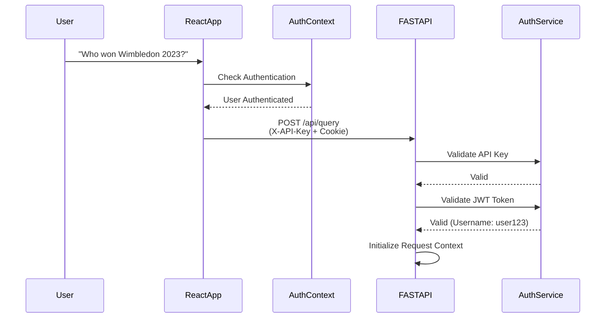
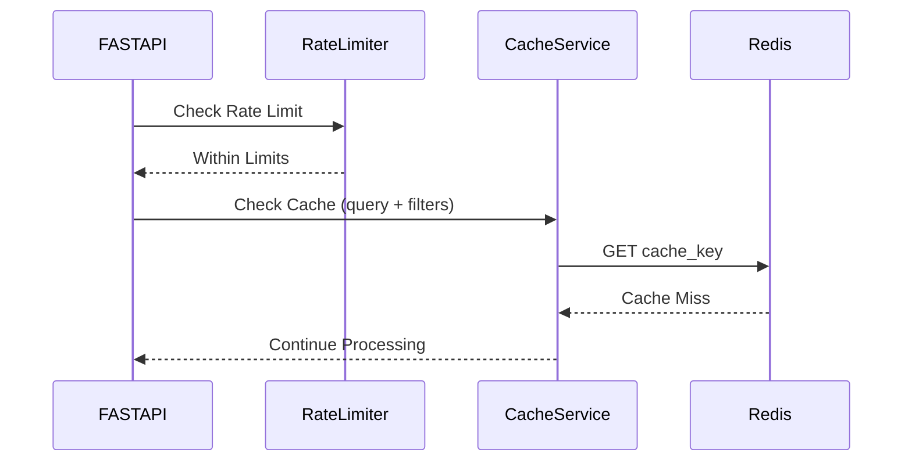
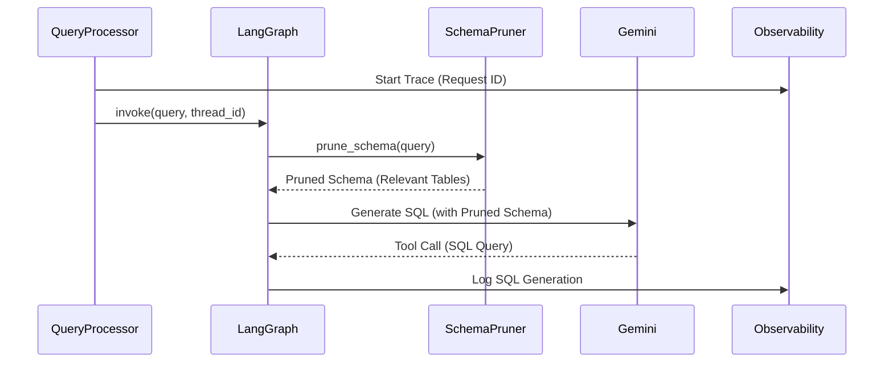
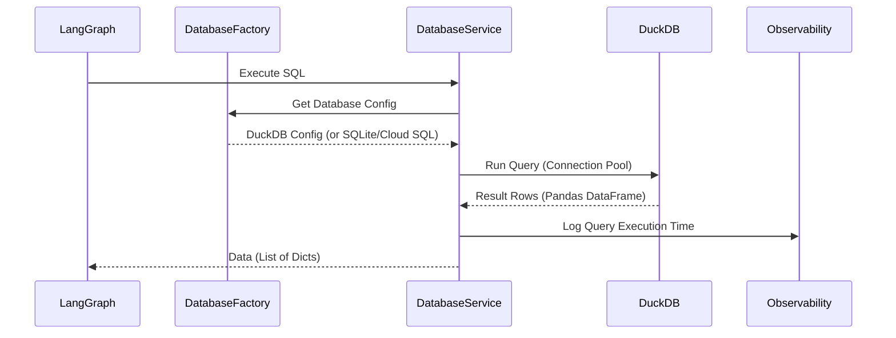
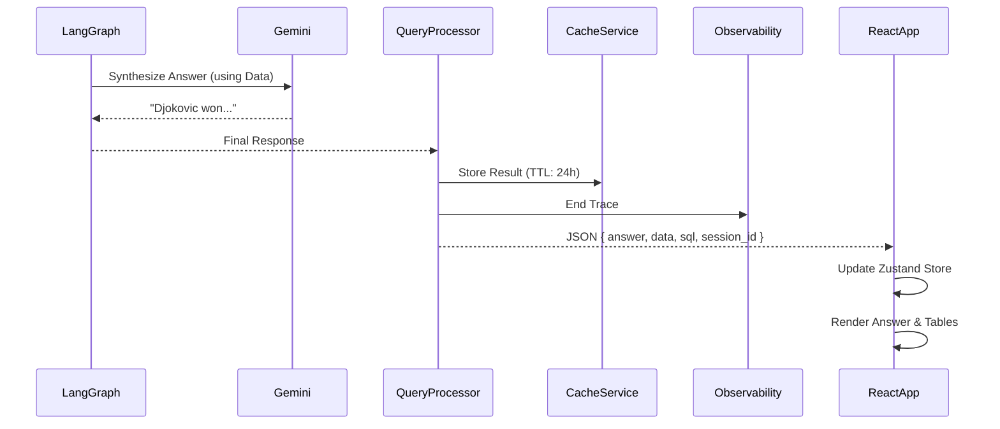

# 🌊 AskTennis AI - Data Flow Architecture

## Overview

The AskTennis AI system processes natural language tennis queries through a sophisticated data flow pipeline with authentication, caching, and observability. It transforms user questions (from the React 19 Frontend) into structured database queries (via FastAPI Backend) and returns formatted, intelligent responses.

## 🔄 Complete Data Flow Diagram

### **Visual Data Flow Overview**
```
┌─────────────────────────────────────────────────────────────────┐
│                    USER INTERFACE LAYER                        │
├─────────────────────────────────────────────────────────────────┤
│  User Input  →  React Frontend →  Auth Check →  API Request    │
│  (Search Component)  (TypeScript)  (JWT)      (X-API-Key)     │
└─────────────────────────────────────────────────────────────────┘
                                │ HTTP POST
                                │ Headers: X-API-Key
                                │ Cookie: access_token (JWT)
                                ▼
┌─────────────────────────────────────────────────────────────────┐
│                    AUTHENTICATION LAYER                        │
├─────────────────────────────────────────────────────────────────┤
│  API Key Check  →  JWT Validation  →  User Context            │
│  (X-API-Key)     (HttpOnly Cookie)   (Username)               │
└─────────────────────────────────────────────────────────────────┘
                                │
                                ▼
┌─────────────────────────────────────────────────────────────────┐
│                    RATE LIMITING LAYER                         │
├─────────────────────────────────────────────────────────────────┤
│  Rate Limiter  →  Check Limits  →  Allow/Reject                │
│  (slowapi)      (Per User/IP)    (429 if exceeded)             │
└─────────────────────────────────────────────────────────────────┘
                                │
                                ▼
┌─────────────────────────────────────────────────────────────────┐
│                    CACHING LAYER                               │
├─────────────────────────────────────────────────────────────────┤
│  Cache Check  →  Redis/DiskCache  →  Hit/Miss                  │
│  (Key: query+  │  (Query Results)   │  (Return or Continue)     │
│   filters)     │                   │                           │
└─────────────────────────────────────────────────────────────────┘
                                │ Cache Miss
                                ▼
┌─────────────────────────────────────────────────────────────────┐
│                    QUERY PROCESSING LAYER                      │
├─────────────────────────────────────────────────────────────────┤
│  FastAPI Router  →  Query Processor  →  LangGraph Agent        │
│  (Validation)     │  (Session Mgmt)   │  (Stateful)             │
└─────────────────────────────────────────────────────────────────┘
                                │
                                ▼
┌─────────────────────────────────────────────────────────────────┐
│                    OBSERVABILITY LAYER                         │
├─────────────────────────────────────────────────────────────────┤
│  OpenTelemetry  →  Request ID  →  Trace Context               │
│  (Tracing)      │  (UUID)       │  (Propagation)               │
└─────────────────────────────────────────────────────────────────┘
                                │
                                ▼
┌─────────────────────────────────────────────────────────────────┐
│                    AI PROCESSING LAYER                         │
├─────────────────────────────────────────────────────────────────┤
│  Schema Pruner  →  Prompt Builder  →  Google Gemini AI        │
│  (Optimizes     │  (Tennis Context) │  (gemini-3-flash)        │
│   Context)      │                  │                           │
└─────────────────────────────────────────────────────────────────┘
                                │ SQL Generation
                                ▼
┌─────────────────────────────────────────────────────────────────┐
│                    DATABASE FACTORY LAYER                      │
├─────────────────────────────────────────────────────────────────┤
│  Database       →  DuckDB/SQLite/  →  Connection Pool          │
│  Factory        │  Cloud SQL        │  (SQLAlchemy)             │
│  (Auto-detect)  │  (PostgreSQL)     │                           │
└─────────────────────────────────────────────────────────────────┘
                                │
                                ▼
┌─────────────────────────────────────────────────────────────────┐
│                    DATA STORAGE LAYER                          │
├─────────────────────────────────────────────────────────────────┤
│  Database Service  →  Execute Query  →  Return Results         │
│  (SQLAlchemy)      │  (Optimized)     │  (Pandas DataFrame)    │
└─────────────────────────────────────────────────────────────────┘
                                │ Raw Data
                                ▼
┌─────────────────────────────────────────────────────────────────┐
│                    CACHE STORAGE LAYER                         │
├─────────────────────────────────────────────────────────────────┤
│  Cache Service  →  Store Result  →  Redis/DiskCache            │
│  (Abstraction)  │  (TTL: 24h)     │  (Serialized)             │
└─────────────────────────────────────────────────────────────────┘
                                │
                                ▼
┌─────────────────────────────────────────────────────────────────┐
│                 RESPONSE PROCESSING LAYER                      │
├─────────────────────────────────────────────────────────────────┤
│  Data Formatter  →  Natural Language  →  API Response          │
│  (Pandas)        │  Synthesis (LLM)   │  (JSON)                │
│                  │                    │  (answer, data, sql)   │
└─────────────────────────────────────────────────────────────────┘
                                │ JSON Response
                                ▼
┌─────────────────────────────────────────────────────────────────┐
│                    FRONTEND RENDERING LAYER                    │
├─────────────────────────────────────────────────────────────────┤
│  Zustand Store  →  Component Update  →  UI Render              │
│  (State Mgmt)    │  (React 19)        │  (Tailwind CSS 4)     │
└─────────────────────────────────────────────────────────────────┘
```

## 📊 Detailed Data Flow Steps

### 1. **User Input Processing**



**Process Details:**
- **Input**: User types query in React `SearchPanel` component.
- **Authentication**: AuthContext checks for valid JWT token.
- **Transmission**: Axios sends payload to `/api/query` with:
  - `X-API-Key` header
  - `access_token` cookie (HttpOnly)
- **Validation**: Pydantic models validate the request body.
- **User Context**: JWT payload provides username for request tracking.

### 2. **Rate Limiting & Caching**



**Caching Strategy:**
- **Cache Key**: Generated from query text + filter parameters + user context.
- **Cache Backend**: Redis (production) or DiskCache (fallback).
- **TTL**: 24 hours default, configurable.
- **Cache Invalidation**: Manual or TTL-based expiration.

### 3. **AI Agent Processing**



**AI Components:**
- **Schema Pruning**: Reduces token usage by identifying only relevant tables/columns (80% reduction).
- **Mapping Tools**: Resolves names like "Djoker" to "Novak Djokovic".
- **Thread Management**: Maintains conversation context via `thread_id`.
- **Observability**: Tracks each step with OpenTelemetry spans.

### 4. **Database Query Execution**



**Database Flow:**
- **Factory Pattern**: Automatically detects database type from environment.
- **Connection Pooling**: Reuses connections for efficiency.
- **Query Optimization**: Uses indexes and optimized SQL.
- **Result Formatting**: Converts to list of dictionaries for JSON serialization.

### 5. **Response Synthesis & Formatting**



**Response Format:**
```json
{
  "answer": "Novak Djokovic won Wimbledon 2023, defeating Nick Kyrgios in the final.",
  "sql_queries": ["SELECT winner_name FROM matches WHERE..."],
  "data": [
    { "winner_name": "Novak Djokovic", "loser_name": "Nick Kyrgios", ... }
  ],
  "conversation_flow": [...],
  "session_id": "abc12345"
}
```

## 📈 Performance Optimization Flows

### 1. **Schema Pruning Optimization**
- Analyzes query keywords using NLP techniques.
- Filters out 80% of unneeded schema columns.
- Results in faster LLM inference (30-50% reduction in tokens).
- Lower cost per query.

### 2. **Caching Strategy**
- **Backend**: Redis for query results (production) or DiskCache (fallback).
- **Backend**: `@lru_cache` for static resource lists (players, tournaments).
- **Frontend**: Zustand state preserves results during session navigation.
- **Cache Key Strategy**: Includes query text, filters, and user context.

### 3. **Database Optimization**
- **Connection Pooling**: Reuses database connections.
- **Indexing**: Strategic indexes on frequently queried columns.
- **Query Optimization**: Uses database-specific optimizations (DuckDB analytics, PostgreSQL indexes).

## 🛡️ Error Handling Flows

### 1. **Authentication Error Handling**
- **Invalid API Key**: Returns 403 Forbidden.
- **Invalid JWT**: Returns 401 Unauthorized, redirects to login.
- **Expired Token**: Returns 401, frontend refreshes token or redirects.

### 2. **Query Error Handling**
- **SQL Error**: Agent catches error, may retry with corrected SQL.
- **Database Error**: Returns 500 with error details (development) or generic message (production).
- **Rate Limit Exceeded**: Returns 429 Too Many Requests with retry-after header.
- **Cache Error**: Falls back to direct database query (graceful degradation).

### 3. **Frontend Error Handling**
- **Network Error**: Displays toast notification with retry option.
- **API Error**: Error boundaries catch and display user-friendly messages.
- **Loading States**: Skeleton loaders during async operations.

## 🔍 Observability Flow

### 1. **Request Tracing**
- **Request ID**: Generated at entry point, propagated through all layers.
- **OpenTelemetry**: Tracks spans for each major operation.
- **Structured Logging**: structlog with request ID for correlation.
- **Metrics**: Tracks query latency, cache hit rates, error rates.

### 2. **Logging Flow**
```
Request → Generate Request ID → Bind to Context → Log Each Step → Correlate in Logs
```

## 🎯 Key Data Flow Benefits

1.  **Decoupled Architecture**: Frontend and Backend scale independently.
2.  **Efficiency**: Heavy processing happens on the backend/AI, keeping the UI responsive.
3.  **Transparency**: The flow returns generated SQL, allowing the UI to show "How I got this answer".
4.  **Security**: Multi-layer authentication ensures secure access.
5.  **Performance**: Caching reduces database load and improves response times.
6.  **Observability**: Full request tracing enables debugging and optimization.
7.  **Resilience**: Graceful error handling and fallback mechanisms.

## 🔄 Authentication Flow

### Login Flow
```
User → Login Form → POST /auth/login → Validate Credentials → 
Generate JWT → Set HttpOnly Cookie → Return Success → 
Frontend Updates AuthContext → Redirect to App
```

### Authenticated Request Flow
```
User → API Request → Extract Cookie → Validate JWT → 
Extract Username → Attach to Request Context → Process Request
```

## 🔄 Cache Flow

### Cache Hit Flow
```
Request → Generate Cache Key → Check Cache → Hit → 
Deserialize → Return Cached Result → Skip Processing
```

### Cache Miss Flow
```
Request → Generate Cache Key → Check Cache → Miss → 
Process Query → Generate Result → Store in Cache → Return Result
```
