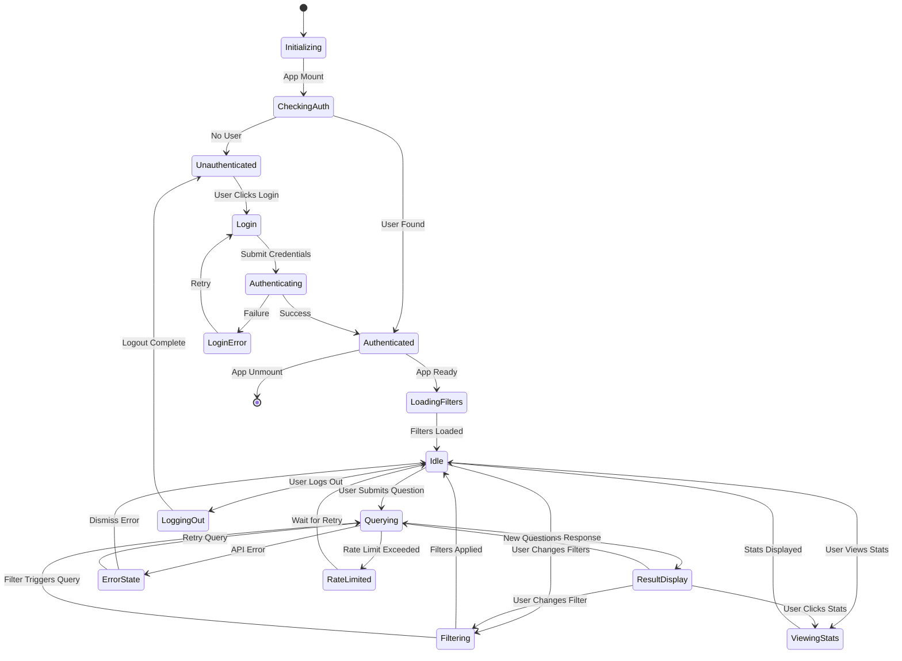
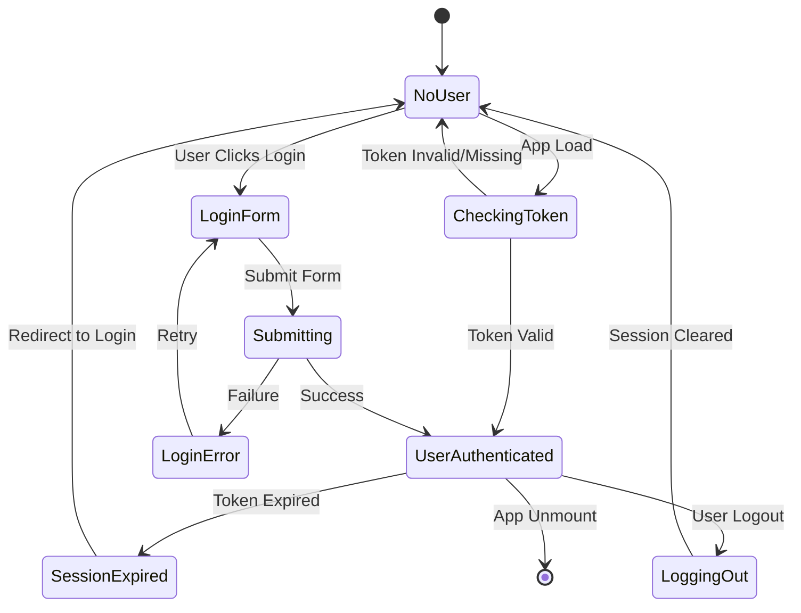
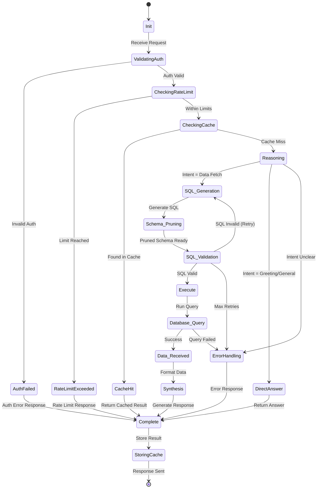
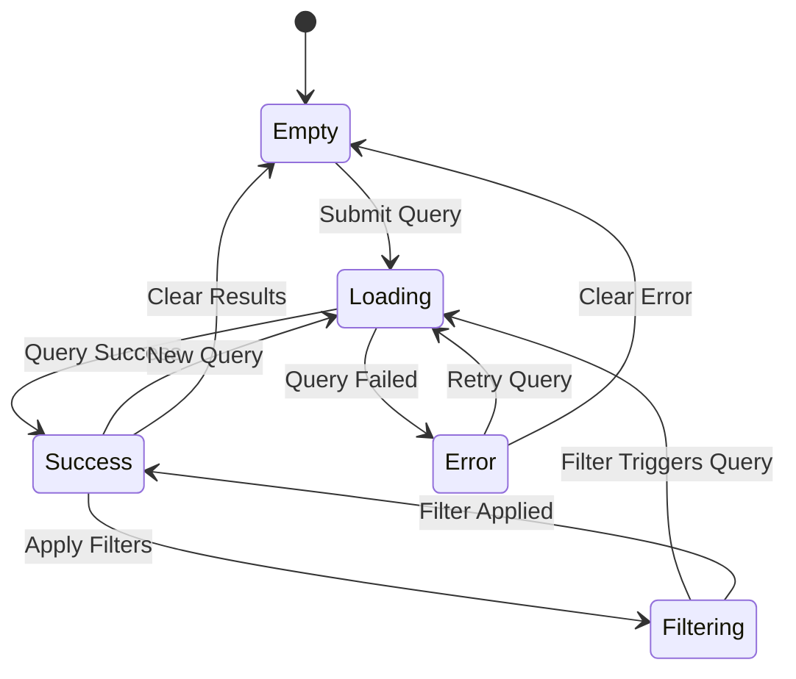
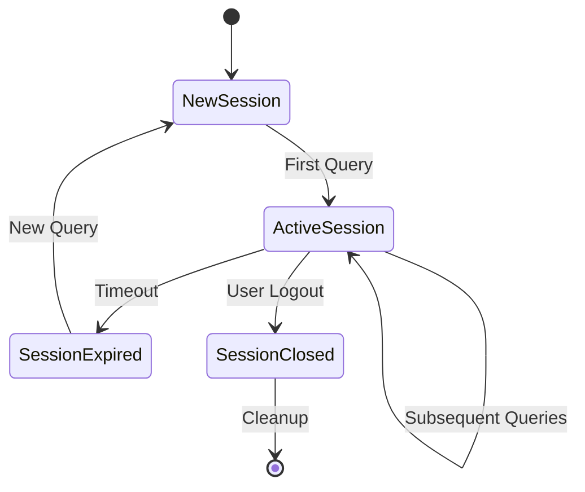

# 🔄 AskTennis AI - State Diagram

## Overview

This document models the life cycle of application states, focusing on the User Interface (React 19), Authentication, and the Agent Processing (Backend) states. The system uses Zustand for state management and maintains session state across requests.

## 🖥️ Application State (Frontend)

The React application moves through several high-level states during user interaction, managed by Zustand and React Context.

### State Descriptions

#### **Initialization States**
-   **Initializing**: App is loading, checking for existing session.
-   **CheckingAuth**: Validating JWT token from HttpOnly cookie.

#### **Authentication States**
-   **Unauthenticated**: User is not logged in, showing login page.
-   **Login**: User is on login page, entering credentials.
-   **Authenticating**: Credentials submitted, waiting for backend response.
-   **LoginError**: Login failed, showing error message.
-   **Authenticated**: User is logged in, JWT token valid.

#### **Application States**
-   **LoadingFilters**: Fetching list of players/tournaments from API.
-   **Idle**: App is loaded, waiting for user input. Filters available.
-   **Querying**: Waiting for AI query request (`/api/query`) to complete. Shows loading spinner.
-   **Filtering**: User is adjusting filters, updating filter state.
-   **ViewingStats**: Displaying statistics dashboard or player profile.

#### **Result States**
-   **ResultDisplay**: Showing answer card, data tables, and SQL queries.
-   **ErrorState**: Showing error message (toast notification or error boundary).
-   **RateLimited**: Rate limit exceeded, showing retry message.

#### **Session States**
-   **LoggingOut**: User initiated logout, clearing session.

## 🔐 Authentication State (Frontend)

Detailed authentication state flow managed by AuthContext.

### Authentication State Details

-   **NoUser**: No authenticated user, login required.
-   **CheckingToken**: Validating JWT token from cookie.
-   **LoginForm**: User entering credentials.
-   **Submitting**: Credentials submitted, awaiting response.
-   **UserAuthenticated**: User logged in, token valid.
-   **SessionExpired**: JWT token expired, re-authentication required.
-   **LoginError**: Login failed (invalid credentials).
-   **LoggingOut**: Logout in progress.

## 🤖 Agent State (Backend)

The LangGraph agent manages the state of a single conversation thread.

### Agent State Descriptions

#### **Request Processing States**
-   **Init**: Agent initialized, ready to receive query.
-   **ValidatingAuth**: Validating API key and JWT token.
-   **CheckingRateLimit**: Verifying rate limits not exceeded.
-   **CheckingCache**: Looking up query in cache (Redis/DiskCache).

#### **Processing States**
-   **Reasoning**: LLM decides next step (Tool call vs Final Answer).
-   **Schema_Pruning**: Optimizing schema context for LLM prompt.
-   **SQL_Generation**: Constructing SQL query based on schema and query intent.
-   **SQL_Validation**: Validating SQL syntax and safety (read-only check).
-   **Execute**: Preparing to execute database query.
-   **Database_Query**: Running query against database (DuckDB/SQLite/Cloud SQL).
-   **Data_Received**: Query results received, formatting data.
-   **Synthesis**: LLM combining raw data with natural language.
-   **DirectAnswer**: LLM provides direct answer without database query.

#### **Completion States**
-   **StoringCache**: Storing result in cache for future requests.
-   **Complete**: Response ready, sending to client.

#### **Error States**
-   **AuthFailed**: Authentication failed (invalid API key or JWT).
-   **RateLimitExceeded**: Rate limit exceeded, must wait.
-   **ErrorHandling**: Error occurred, generating error response.

## 📊 Query State (Frontend - Zustand)

State management for AI queries using Zustand store.

### Query State Details

-   **Empty**: No query results, initial state.
-   **Loading**: Query in progress, showing loading indicator.
-   **Success**: Query completed successfully, results available.
-   **Error**: Query failed, error message displayed.
-   **Filtering**: Filters being applied, may trigger new query.

## 🔄 Session State (Backend)

Session management for LangGraph agent conversations.

### Session State Details

-   **NewSession**: New conversation thread created (`thread_id` generated).
-   **ActiveSession**: Active conversation with history maintained.
-   **SessionExpired**: Session timeout (future enhancement).
-   **SessionClosed**: Session ended, cleanup performed.

## 🎯 State Transitions & Triggers

### **Frontend State Transitions**

| From State | Trigger | To State | Action |
|------------|---------|----------|--------|
| Idle | User submits query | Querying | Send POST `/api/query` |
| Querying | API success response | ResultDisplay | Update Zustand store, render results |
| Querying | API error response | ErrorState | Show error toast |
| Querying | Rate limit (429) | RateLimited | Show retry message |
| ResultDisplay | User submits new query | Querying | Clear previous results, send new query |
| Authenticated | Token expired | Unauthenticated | Clear AuthContext, redirect to login |

### **Backend State Transitions**

| From State | Trigger | To State | Action |
|------------|---------|----------|--------|
| Init | Request received | ValidatingAuth | Extract and validate credentials |
| ValidatingAuth | Auth valid | CheckingRateLimit | Check rate limits |
| CheckingCache | Cache hit | Complete | Return cached result |
| CheckingCache | Cache miss | Reasoning | Process query with agent |
| Reasoning | Data fetch intent | SQL_Generation | Generate SQL query |
| SQL_Generation | SQL valid | Execute | Run database query |
| Execute | Query success | Synthesis | Format and synthesize response |

## 🛡️ Error State Handling

### **Frontend Error States**
- **Network Error**: API request failed, show retry option.
- **Authentication Error**: Token invalid, redirect to login.
- **Rate Limit Error**: Show retry-after message.
- **Validation Error**: Invalid input, show field errors.

### **Backend Error States**
- **Auth Error**: Return 401/403, log security event.
- **Rate Limit Error**: Return 429 with retry-after header.
- **SQL Error**: Agent retries with corrected SQL (up to max retries).
- **Database Error**: Return 500, log error with request ID.

## 🔍 State Persistence

### **Frontend State Persistence**
- **Zustand Store**: In-memory state, cleared on page refresh.
- **AuthContext**: JWT token in HttpOnly cookie persists across sessions.
- **Local Storage**: (Future) Save user preferences, recent queries.

### **Backend State Persistence**
- **Session State**: LangGraph maintains conversation history via `thread_id`.
- **Cache State**: Redis/DiskCache persists query results (TTL: 24h).
- **User State**: Authentication database stores user sessions.

---

## 🎯 Key State Management Benefits

1. **Predictable Flow**: Clear state transitions enable reliable user experience.
2. **Error Recovery**: Error states provide clear paths for recovery.
3. **Performance**: Caching states reduce redundant processing.
4. **Security**: Authentication states ensure secure access.
5. **User Experience**: Loading states provide feedback during async operations.
6. **Debugging**: State diagrams help identify issues in user flows.

This state diagram provides a comprehensive view of how the application manages state across frontend and backend, ensuring reliable operation and good user experience.
