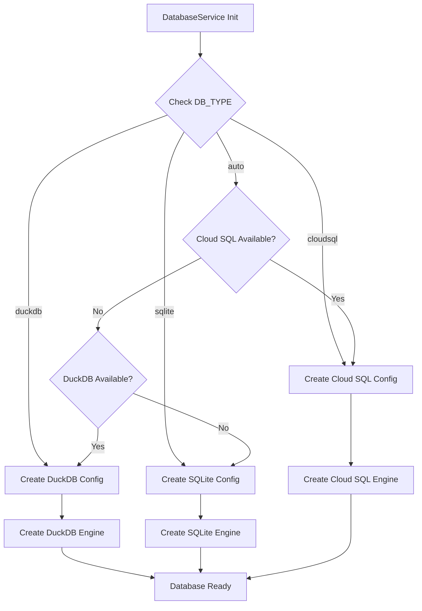
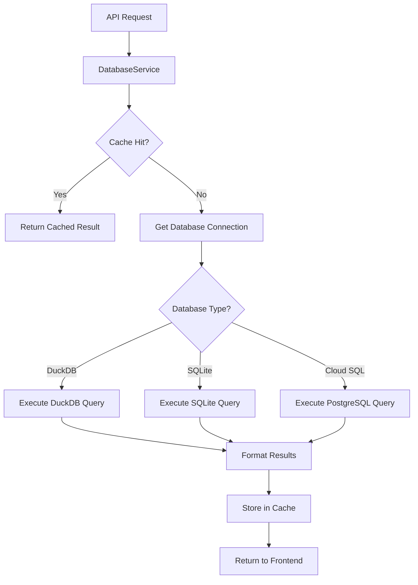

# 🗄️ AskTennis AI - Database Architecture

## Overview

The AskTennis AI system supports a flexible, multi-database architecture that accommodates local development (DuckDB, SQLite) and production deployments (Cloud SQL PostgreSQL). This document outlines the database architecture, configuration, optimization strategies, and the factory pattern implementation for seamless database switching.

## 🎯 Database Architecture Options

### **Current Implementation: Multi-Database Support**

The system uses a **factory pattern** that supports three database backends:

1. **DuckDB** (Local Development - Recommended)
   - High-performance analytical database
   - Columnar storage optimized for analytics
   - Fast aggregations and joins
   - Zero configuration, single-file deployment
   - Ideal for data analysis and testing

2. **SQLite** (Local Fallback)
   - File-based database
   - Zero configuration
   - Simple deployment
   - Good for basic development and fallback scenarios

3. **Cloud SQL PostgreSQL** (Production)
   - Managed PostgreSQL database
   - Scalable and production-ready
   - Supports multiple concurrent users
   - Automatic backups and high availability
   - Advanced features (full-text search, JSON support)

4. **Authentication Database** (Separate)
   - SQLite (local) or Cloud SQL (production)
   - Isolated from main data
   - Stores user credentials, sessions, and **per-user query history** (AI query results)
   - Enhanced security through separation

## 🏗️ Database Architecture

### **Visual Database Architecture**
```
┌─────────────────────────────────────────────────────────────────┐
│                    BACKEND DATA LAYER                          │
├─────────────────────────────────────────────────────────────────┤
│  Database Factory  │  Configuration Detection  │  Connection   │
│  (Auto-detect)     │  (Environment Variables) │  Management   │
│                    │                           │  (SQLAlchemy) │
└─────────────────────────────────────────────────────────────────┘
                                │
                ┌───────────────┼───────────────┐
                │               │               │
                ▼               ▼               ▼
┌──────────────────────┐  ┌──────────────────────┐  ┌──────────────────────┐
│   DuckDB Database    │  │   SQLite Database    │  │  Cloud SQL (PostgreSQL)│
│  (Local Development) │  │  (Local Fallback)    │  │  (Production)         │
├──────────────────────┤  ├──────────────────────┤  ├──────────────────────┤
│  • Columnar storage  │  │  • File-based        │  │  • Managed service   │
│  • Analytics-opt     │  │  • Zero config      │  │  • Auto backups      │
│  • Fast queries      │  │  • Portable          │  │  • High availability │
│  • Single file      │  │  • Simple            │  │  • Multi-user        │
└──────────────────────┘  └──────────────────────┘  └──────────────────────┘
                                │
                                ▼
┌─────────────────────────────────────────────────────────────────┐
│              AUTHENTICATION DATABASE (Separate)                 │
├─────────────────────────────────────────────────────────────────┤
│  SQLite (Local)  │  Cloud SQL (Production)  │  Users Table     │
│  auth.db         │  asktennis_auth          │  (Credentials)   │
│                  │                          │  Query History   │
│                  │                          │  (per-user)  │
└─────────────────────────────────────────────────────────────────┘
```

## 🔧 Database Configuration

### 1. **DuckDB Configuration (Local Development - Recommended)**

```python
# Environment variables
DB_TYPE=duckdb
DB_PATH=duckdb:///data/tennis_data_with_mcp.db

# Or programmatically
from config.database.database_factory import DatabaseFactory
db_config = DatabaseFactory.create_config(db_type="duckdb")
```

**Characteristics:**
- **File-based**: Single file database (`tennis_data_with_mcp.db`)
- **Columnar Storage**: Optimized for analytical queries
- **Zero Configuration**: No server setup required
- **Fast**: Optimized for local queries and analytics
- **Portable**: Easy to backup and move

**Use Cases:**
- Local development
- Data analysis and testing
- Performance testing
- Analytics workloads

### 2. **SQLite Configuration (Local Fallback)**

```python
# Environment variables
DB_TYPE=sqlite
DB_PATH=sqlite:///tennis_data.db

# Or programmatically
db_config = DatabaseFactory.create_config(db_type="sqlite")
```

**Characteristics:**
- **File-based**: Single file database (`tennis_data.db`)
- **Zero Configuration**: No server setup required
- **Simple**: Easy to understand and debug
- **Portable**: Easy to backup and move
- **Compatible**: Works everywhere Python works

**Use Cases:**
- Simple local development
- Fallback when DuckDB unavailable
- Testing database operations
- Minimal setup scenarios

### 3. **Cloud SQL Configuration (Production)**

```python
# Environment variables
DB_TYPE=cloudsql
INSTANCE_CONNECTION_NAME=project:region:instance
DB_USER=database_user
DB_PASSWORD=database_password  # From Secret Manager
DB_NAME=tennis_data
DB_ENGINE=postgresql

# Or programmatically
db_config = DatabaseFactory.create_config(force_cloud_sql=True)
```

**Characteristics:**
- **Managed Service**: Fully managed PostgreSQL database
- **Scalable**: Handles multiple concurrent users
- **Reliable**: Automatic backups and high availability
- **Secure**: Encrypted connections and data at rest
- **Advanced Features**: Full-text search, JSON support, advanced indexing

**Use Cases:**
- Production deployments
- Multi-user scenarios
- High-availability requirements
- Advanced PostgreSQL features needed

### 4. **Authentication Database Configuration**

```python
# Separate database for authentication
# Local: SQLite
AUTH_DB_PATH=sqlite:///auth.db

# Production: Cloud SQL
AUTH_DB_NAME=asktennis_auth
# Uses same Cloud SQL instance, different database
```

**Characteristics:**
- **Isolated**: Separate from main data
- **Secure**: Enhanced security through separation
- **Scalable**: Can use Cloud SQL in production
- **Simple**: SQLite for local development

## 📊 Database Schema

### **Core Tables**

1. **matches**: 1.7M+ singles matches (1877-2024)
   - Match results, scores, statistics
   - Player information (winner, loser)
   - Tournament details (name, surface, date)
   - Detailed match statistics (aces, double faults, etc.)

2. **players**: 136K+ players with metadata
   - Player information (name, nationality, physical attributes)
   - Career information
   - External references (Wikidata ID)

3. **rankings**: 5.3M+ ranking records (1973-2024)
   - Historical ranking data
   - Ranking points and tournament counts
   - Tour-specific rankings (ATP, WTA)

4. **doubles_matches**: 26K+ doubles matches (2000-2020)
   - Team-based match data
   - Individual player statistics

5. **users** (Authentication Database)
   - User credentials (username, hashed password)
   - Account metadata (created_at, last_login)

### **Database Views**

- **matches_with_full_info**: Matches with full player information
- **matches_with_rankings**: Matches with ranking context
- **player_rankings_history**: Complete ranking history per player

### **Database Indexes**

- **Match-based indexes**: `winner_id`, `loser_id`, `year`, `tournament`, `surface`
- **Player-based indexes**: `player_id`, `name`, `country`, `hand`
- **Ranking-based indexes**: `player`, `date`, `rank`, `tour`
- **Composite indexes**: Multi-column indexes for complex queries

## 🚀 Database Service Architecture

### **DatabaseFactory Pattern**

```python
class DatabaseFactory:
    """Factory for creating database configuration instances."""
    
    @staticmethod
    def create_config(
        db_path: Optional[str] = None,
        force_sqlite: bool = False,
        force_cloud_sql: bool = False,
    ) -> DatabaseConfig:
        """
        Create a database configuration instance based on environment settings.
        Automatically detects database type from environment variables.
        """
        # Check environment for explicit DB type
        db_type = os.getenv("DB_TYPE", "").lower()
        
        # Detection logic:
        # 1. Check DB_TYPE environment variable
        # 2. Check for Cloud SQL configuration
        # 3. Default to DuckDB if available, otherwise SQLite
        
        if db_type == "duckdb":
            return DuckDBConfig(db_path)
        elif db_type == "sqlite":
            return SQLiteConfig(db_path)
        elif force_cloud_sql or DatabaseFactory._is_cloud_sql_config():
            return CloudSQLConfig()
        else:
            # Default: DuckDB if available, otherwise SQLite
            return DuckDBConfig() or SQLiteConfig(db_path)
```

**Key Features:**
- **Automatic Detection**: Detects database type from environment variables
- **Unified Interface**: Same API for all database types
- **Flexible Configuration**: Supports explicit configuration or auto-detection
- **Fallback Logic**: Graceful fallback to simpler databases

### **DatabaseService Class**

```python
class DatabaseService:
    """Service for database operations with multi-database support."""
    
    def __init__(self):
        """Initialize database service with automatic configuration."""
        self.db_config = DatabaseFactory.create_config()
        self.engine = self.db_config.get_engine()
        self.SessionLocal = sessionmaker(bind=self.engine)
    
    def _get_connection(self):
        """Get database connection (context manager)."""
        return self.engine.connect()
    
    def execute_query(self, query: str):
        """Execute SQL query and return results."""
        with self._get_connection() as conn:
            return pd.read_sql(query, conn)
```

**Key Features:**
- **Connection Pooling**: Efficient connection management
- **Unified Interface**: Same methods work for all database types
- **Error Handling**: Graceful error handling and fallback
- **Performance**: Optimized for each database type

## 🔄 Database Connection Flow

### **Connection Initialization**



### **Query Execution Flow**



## 📈 Performance Optimization

### 1. **Indexing Strategy**

**Primary Indexes:**
- On frequently queried columns
- Foreign key columns
- Date/time columns for time-series queries

**Composite Indexes:**
- For multi-column queries
- Common filter combinations
- Join optimization

**Covering Indexes:**
- Include frequently selected columns
- Reduce need for table lookups

### 2. **Caching Strategy**

**Application-Level Caching:**
- Redis (production) or DiskCache (fallback)
- Query result caching (TTL: 24h)
- Cache key includes query + filters + user context

**Database-Level Caching:**
- Connection pooling
- Query plan caching (PostgreSQL)
- Materialized views (future)

**Static Data Caching:**
- `@lru_cache` for player names, tournament lists
- In-memory caching for frequently accessed data

### 3. **Query Optimization**

**Schema Pruning:**
- Reduces schema information in LLM prompts
- Identifies relevant tables/columns
- 80% reduction in token usage

**Query Optimization:**
- Uses database-specific optimizations
- DuckDB: Columnar processing, vectorization
- PostgreSQL: Query planner optimization
- SQLite: Index usage optimization

**Result Truncation:**
- Limits result sets to 100 rows (configurable)
- Prevents large payloads
- Improves response times

## 🛡️ Database Security

### 1. **Connection Security**

**Local Development:**
- File-based databases (DuckDB, SQLite)
- File system permissions
- No network exposure

**Production (Cloud SQL):**
- SSL/TLS encrypted connections
- Cloud SQL Proxy for secure access
- IP whitelisting (optional)
- Private IP (recommended)

### 2. **Data Protection**

**Encryption:**
- **At Rest**: Cloud SQL encrypts data at rest
- **In Transit**: SSL/TLS for all connections
- **Backups**: Encrypted backups

**Access Control:**
- Database user authentication
- Role-based access control
- Read-only access for application users
- Separate authentication database

### 3. **Credential Management**

**Local Development:**
- `.env` file (gitignored)
- Environment variables

**Production:**
- Google Cloud Secret Manager
- Environment variables in Cloud Run
- No hardcoded credentials

## 🔄 Database Migration

### **Migration Strategy**

1. **Development**: Start with DuckDB/SQLite for local development
2. **Staging**: Test with Cloud SQL in staging environment
3. **Production**: Deploy with Cloud SQL for production

### **Data Migration**

**SQLite to Cloud SQL:**
- Export data from SQLite
- Transform schema if needed
- Import to PostgreSQL
- Validate data integrity

**DuckDB to Cloud SQL:**
- Export data from DuckDB
- Transform to PostgreSQL format
- Import to Cloud SQL
- Validate data integrity

### **Schema Migration**

**Current Approach:**
- Manual schema updates
- SQL scripts for migrations
- Version control for schema changes

**Future Enhancement:**
- Alembic for schema migrations
- Automated migration scripts
- Rollback capabilities

## 📊 Database Monitoring

### 1. **Performance Monitoring**

**Query Performance:**
- Track query execution times
- Identify slow queries
- Optimize frequently used queries

**Connection Pooling:**
- Monitor connection pool usage
- Track connection wait times
- Adjust pool size as needed

**Cache Hit Rates:**
- Monitor cache effectiveness
- Track cache hit/miss ratios
- Optimize cache TTL

### 2. **Health Monitoring**

**Database Health:**
- Monitor database status
- Track connection errors
- Monitor disk usage

**Connection Health:**
- Monitor connection status
- Track connection failures
- Alert on connection issues

**Error Tracking:**
- Log database errors
- Track error rates
- Alert on critical errors

## 🔮 Future Database Enhancements

### 1. **Advanced Features**

**Read Replicas:**
- For read-heavy workloads
- Distribute read queries
- Improve performance

**Partitioning:**
- Partition large tables by year
- Improve query performance
- Easier data management

**Materialized Views:**
- Pre-computed aggregations
- Faster complex queries
- Refresh strategies

### 2. **Scalability**

**Horizontal Scaling:**
- Database sharding (future)
- Distributed queries
- Load balancing

**Vertical Scaling:**
- Larger instance sizes
- More CPU/memory
- Better performance

**Connection Pooling:**
- Optimize pool sizes
- Connection multiplexing
- Better resource utilization

### 3. **Advanced Analytics**

**Time-Series Optimization:**
- For ranking data
- Efficient time-range queries
- Aggregation optimization

**Full-Text Search:**
- Enhanced player/tournament search
- PostgreSQL FTS integration
- Better search relevance

**JSON Support:**
- Flexible metadata storage
- PostgreSQL JSON columns
- Query JSON data

---

## 🎯 Key Database Architecture Benefits

1. **Flexibility**: Support for multiple database backends
2. **Performance**: Optimized for each database type
3. **Scalability**: Cloud SQL for production scalability
4. **Security**: Encrypted connections and data
5. **Ease of Use**: Automatic configuration detection
6. **Cost Efficiency**: DuckDB/SQLite for development, Cloud SQL for production
7. **Migration Path**: Easy migration between databases
8. **Maintainability**: Factory pattern simplifies management

This database architecture provides a solid foundation for comprehensive tennis analytics while maintaining flexibility, performance, and scalability across different deployment scenarios. The factory pattern enables seamless switching between database backends without code changes, making it ideal for development, testing, and production environments.
